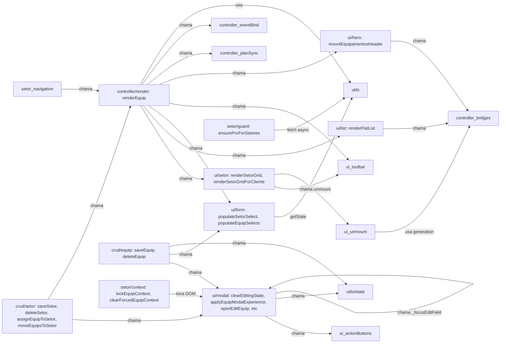

# Mudança 11 — Inventário de equipamentos.js

> Gerado em CP-A. Será atualizado a cada CP conforme funções saem do arquivo original.
> Última atualização: 2026-05-07 (CP-E — setor UI/state leve extraído).

## Métricas atuais

| Métrica                                                            |                                                                                                         Valor |
| ------------------------------------------------------------------ | ------------------------------------------------------------------------------------------------------------: |
| LOC total (pré-anotação JSDoc)                                     |                                                                                                          2746 |
| LOC total (pós-anotação JSDoc, fim do CP-A)                        |                                                                                                          2846 |
| LOC total (pós-CP-B, 7 fns extraídas)                              |                                                                                                          2613 |
| LOC total (pós-CP-B.5, state module-level extraído)                |                                                                                                          2612 |
| LOC total (pós-CP-C, render plan + React bridges extraídos)        |                                                                                                          2496 |
| LOC total (pós-CP-E.0, pré-split setor in-place)                   |                                                                                                          2540 |
| LOC total (pós-CP-E, setor UI/state leve extraído)                 |                                                                                                          2272 |
| Funções top-level declaradas                                       |                                                                                                            54 |
| Linhas com `@sliceTarget` simples                                  |                                                                                                            44 |
| Linhas com `@sliceSplit` (multi-destino)                           |                                                                                                            10 |
| Imports externos (linhas `^import`)                                |                                                                                                            41 |
| Chamadas a `getState/setState/findEquip/findSetor/regsForEquip`    |                                                                                                            26 |
| Chamadas diretas a Storage / Supabase / persist                    |                                                                                                             3 |
| Acessos a DOM (`document.*`, `querySelector`, `Utils.getEl`, etc.) |                                                                                                           184 |
| Funções `async`                                                    |                                                                                                            10 |
| God-functions (LOC > 100)                                          | 4 (`viewEquip` 448, `saveEquip` 234, `renderSetorGridForCliente` 147, `openEditEquip` 144, `renderEquip` 141) |

## Distribuição por categoria

Tally pela categoria **primária** (em `@sliceSplit` conta-se a primeira listada). Funções do tipo split aparecem também listadas em §"Funções com `@sliceSplit`" abaixo.

| Categoria         |                                                         Funções | LOC estimado |    % LOC |
| ----------------- | --------------------------------------------------------------: | -----------: | -------: |
| ui                |                                                              27 |        ~1471 |     ~62% |
| crud              |                                                               6 |         ~402 |     ~17% |
| controller        |                                                               7 |         ~214 |      ~9% |
| utils             |                              10 (7 movidas + 3 reclassificadas) |         ~206 |      ~9% |
| setor             |                                                               4 |          ~93 |      ~4% |
| nameplate         |                                    0 (só secundária em 1 split) |            — |        — |
| risco             |                                    0 (só secundária em 1 split) |            — |        — |
| filtros           | 0 (filtragem mora em `equipamentos/`, não no arquivo principal) |            — |        — |
| **Total funções** |                                                          **54** |    **~2386** | **100%** |

**Observações iniciais:**

- **`ui` domina absoluto (62% do LOC)** — esperado para uma god-view, mas significa que CP-G (UI) será o maior em volume.
- **`filtros/` já está extraída** pra `src/ui/views/equipamentos/` (módulo `helpers.js`, `equipmentCards.js`, `hero.js`, etc.). O arquivo principal não tem mais lógica de filtro pura — só orquestração de filtro via `_navigateEquipCtx` e `buildEquipamentosViewModel`. Isso simplifica o blueprint da Mudança 11: **categoria `filtros` pode ser desconsiderada como CP separado** ou virar um CP fino para extrair os helpers de "quick filter" residuais.
- **`risco/` aparece só como split em `viewEquip`** (linhas de risk panel). Pode virar uma sub-extração dentro de CP-G, não um CP próprio.
- **`nameplate/` aparece só como split em `openEditEquip`**. Idem: sub-extração, não CP próprio.

## Tabela completa das 54 funções

Convenção de **Side effects** (abrev.):

- `pure` — nenhum side effect
- `state` — getState / setState / módulo-level vars
- `DOM` — `document.*`, `Utils.getEl`, etc.
- `supabase` — chamada via Storage/Supabase
- `local` — localStorage / IndexedDB / nameplate metadata
- `async` — função async

Convenção de **Chamada por (n)**: número de chamadas internas ao arquivo. Fazer auditoria de chamadas externas é trabalho de CP-G (precondição pra remover fachadas).

|   # | Função                                   | Linha | LOC | Categoria              | Slice destino                           | Side effects                  | Obs                                 |
| --: | ---------------------------------------- | ----: | --: | ---------------------- | --------------------------------------- | ----------------------------- | ----------------------------------- |
|   1 | `syncComponenteVisibility`               |   115 |  12 | ui                     | ui/componente                           | DOM                           | Idempotent toggle                   |
|   2 | `loadEquipamentosHeaderBridge`           |   143 |   8 | controller             | controller/bridges                      | async, state                  | Lazy import memoizado               |
|   3 | `loadEquipamentosListBridge`             |   152 |   8 | controller             | controller/bridges                      | async, state                  | Lazy import memoizado               |
|   4 | `unmountEquipamentosHeader`              |   161 |  15 | ui                     | ui/unmount                              | DOM, state                    | Generation counter                  |
|   5 | `unmountEquipamentosList`                |   177 |  15 | ui                     | ui/unmount                              | DOM, state                    | Generation counter                  |
|   6 | `_bindRenderEquipPlanInvalidationEvents` |   193 |  11 | controller             | controller/eventBind                    | state                         | Bind global events 1x               |
|   7 | `_stripRenderInternalOptions`            |   205 |   4 | utils                  | utils/options                           | pure                          | Helper destructure                  |
|   8 | `_refreshRenderEquipPlan`                |   210 |  26 | controller             | controller/planSync                     | async, state, supabase        | Plan refresh assíncrono             |
|   9 | `getEditingEquipId`                      |   237 |   3 | utils                  | utils/state                             | state                         | Getter trivial                      |
|  10 | `setEquipActionButtonVisible`            |   241 |   7 | ui                     | ui/actionButtons                        | DOM                           | Show/hide button + row              |
|  11 | `setEquipActionFooterHintVisible`        |   249 |   4 | ui                     | ui/actionButtons                        | DOM                           | Toggle hint                         |
|  12 | `createActionTrayPlusIcon`               |   254 |  15 | ui                     | ui/svg                                  | DOM                           | SVG factory                         |
|  13 | `setEquipActionTrayButtonLabel`          |   270 |   6 | ui                     | ui/actionButtons                        | DOM                           | Update label + icon                 |
|  14 | `clearEditingState`                      |   276 |  40 | **ui** (split)         | ui/modal + crud/clear                   | DOM, state, local             | Reset modal+nameplate metadata      |
|  15 | `applyEquipModalExperience`              |   317 |  92 | **ui** (split)         | ui/modal + setor/context                | DOM, state                    | Plan-aware UX path explosion        |
|  16 | `clearForcedEquipContext`                |   410 |  15 | setor                  | setor/context                           | DOM, state                    | Clear locked context                |
|  17 | `lockEquipContext`                       |   427 |  47 | setor                  | setor/context                           | DOM, state                    | Lock cliente/setor                  |
|  18 | `getActiveQuickFilter`                   |   499 |   2 | utils                  | utils/state                             | state                         | Getter trivial                      |
|  19 | `setActiveQuickFilter`                   |   502 |   8 | controller             | controller/navigation                   | state                         | Navega quick filter                 |
|  20 | `_setToolbar`                            |   529 |  23 | ui                     | ui/toolbar                              | DOM                           | Title + actions                     |
|  21 | `mountEquipamentosHeader`                |   553 |  12 | controller             | controller/mount                        | async, DOM, state             | React bridge mount                  |
|  22 | `_lockedSetorBtnHtml`                    |   572 |  15 | ui                     | ui/setor                                | pure (HTML)                   | HTML factory                        |
|  23 | `populateSetorSelect`                    |   589 |  31 | ui                     | ui/form                                 | DOM, state                    | Setor dropdown                      |
|  24 | `setActiveSector`                        |   625 |  11 | setor                  | setor/navigation                        | state                         | Navega setor                        |
|  25 | `renderSetorGrid`                        |   638 |  39 | **ui** (split)         | ui/setor + controller/render            | DOM, state                    | Pro grid render                     |
|  26 | `renderSetorGridForCliente`              |   686 | 147 | **ui** (split)         | ui/setor + controller/render            | DOM, state                    | Bug fix #100 dual-path              |
|  27 | `buildEquipamentoListCardModel`          |   840 |  76 | utils                  | utils/cardModel                         | pure                          | ViewModel build                     |
|  28 | `buildReactListEmptyState`               |   917 |  37 | utils                  | utils/emptyState                        | pure                          | ViewModel build                     |
|  29 | `buildReactListViewModel`                |   955 |  18 | utils                  | utils/listModel                         | pure                          | ViewModel aggregate                 |
|  30 | `renderFlatList`                         |   975 |  62 | **ui** (split)         | ui/list + controller/render             | DOM, state, local             | React mount + skeleton              |
|  31 | `renderEquip`                            |  1038 | 141 | **controller** (split) | controller/render + ui/hero + ui/list   | async, DOM, state, supabase   | God-orchestrator. Pré-split em CP-G |
|  32 | `ensureProForSetores`                    |  1186 |  20 | setor                  | setor/guard                             | async, supabase, DOM          | Plan gate                           |
|  33 | `_setSaveBtnLabel`                       |  1211 |   7 | ui                     | ui/modal                                | DOM                           | Helper micro                        |
|  34 | `_setSetorNomeValidationState`           |  1218 |  11 | ui                     | ui/validation                           | DOM                           | Validation visual                   |
|  35 | `_syncSetorSaveButtonState`              |  1229 |   7 | ui                     | ui/validation                           | DOM                           | Sync save button                    |
|  36 | `getEditingSetorId`                      |  1240 |   3 | utils                  | utils/state                             | state                         | Getter trivial                      |
|  37 | `moveEquipsToSetor`                      |  1260 |  32 | crud                   | crud/move                               | state, async                  | Batch move                          |
|  38 | `clearSetorEditingState`                 |  1294 |  42 | ui                     | ui/modal                                | DOM, state                    | Reset setor form                    |
|  39 | `openEditSetor`                          |  1337 |  46 | ui                     | ui/modal                                | DOM, state                    | Open setor editor                   |
|  40 | `_syncSetorModalPreview`                 |  1389 |  49 | ui                     | ui/preview                              | DOM                           | Live preview                        |
|  41 | `_syncSetorModalCounters`                |  1438 |  21 | ui                     | ui/validation                           | DOM                           | Char counters                       |
|  42 | `initSetorColorPicker`                   |  1458 |  59 | ui                     | ui/colorPicker                          | DOM                           | Bind color picker                   |
|  43 | `saveSetor`                              |  1518 |  65 | **crud** (split)       | crud/setor + ui/modal                   | state, local, async           | CRUD + modal close                  |
|  44 | `deleteSetor`                            |  1584 |  28 | crud                   | crud/setor                              | state, local, async           | Delete + orphan equips              |
|  45 | `assignEquipToSetor`                     |  1617 |  18 | crud                   | crud/setor                              | state, async                  | Assign equip→setor                  |
|  46 | `openEditEquip`                          |  1669 | 144 | **ui** (split)         | ui/modal + nameplate                    | async, DOM, state, supabase   | Form pre-pop                        |
|  47 | `_focusEditField`                        |  1824 |  71 | ui                     | ui/modal                                | DOM                           | Expand+scroll+focus                 |
|  48 | `saveEquip`                              |  1896 | 234 | **crud** (split)       | crud/equip + ui/modal + controller/post | async, state, local, supabase | God-CRUD. Pré-split em CP-F         |
|  49 | `_eqDetailSubtitle`                      |  2137 |  10 | utils                  | utils/detail                            | pure (HTML)                   | Subtitle "Local · TAG"              |
|  50 | `_infoRowValueOrEmpty`                   |  2161 |  15 | utils                  | utils/detail                            | pure (HTML)                   | Row value or CTA                    |
|  51 | `_riskFactorChipHtml`                    |  2190 |  38 | utils                  | utils/detail                            | pure (HTML)                   | Risk factor chip                    |
|  52 | `viewEquip`                              |  2229 | 448 | **ui** (split)         | ui/detail + risco                       | async, DOM, supabase          | God-detail. Pré-split em CP-G       |
|  53 | `deleteEquip`                            |  2678 |  25 | crud                   | crud/equip                              | state, local, async           | Delete + cascade                    |
|  54 | `populateEquipSelects`                   |  2704 |  43 | ui                     | ui/form                                 | DOM, state                    | Selects + datalist                  |

## Funções com `@sliceSplit` (responsabilidades misturadas)

|   # | Função                      | Linha | LOC | Destinos                                | Estratégia de split                                                                                                                                                                                        |
| --: | --------------------------- | ----: | --: | --------------------------------------- | ---------------------------------------------------------------------------------------------------------------------------------------------------------------------------------------------------------- |
|  14 | `clearEditingState`         |   276 |  40 | ui/modal + crud/clear                   | Carve `crud/clear` (reset de `_editingEquipId` + nameplate metadata + `clearForcedEquipContext`). Resto fica em `ui/modal`.                                                                                |
|  15 | `applyEquipModalExperience` |   317 |  92 | ui/modal + setor/context                | Carve helper `_readForcedContext()` em `setor/context`. Mantém branching plan-aware em `ui/modal`.                                                                                                         |
|  25 | `renderSetorGrid`           |   638 |  39 | ui/setor + controller/render            | Mover orquestração (unmount, fetch state, set toolbar) pra `controller/render`. Render dos cards fica em `ui/setor`.                                                                                       |
|  26 | `renderSetorGridForCliente` |   686 | 147 | ui/setor + controller/render            | Idem 25, mais bug fix #100 dual-path filter. Maior split — vale commit dedicado dentro de CP-D.                                                                                                            |
|  30 | `renderFlatList`            |   975 |  62 | ui/list + controller/render             | Carve build de viewModel + skeleton wrapper pra `ui/list`. Mantém orquestração em `controller/render`.                                                                                                     |
|  31 | `renderEquip`               |  1038 | 141 | controller/render + ui/hero + ui/list   | God-orchestrator. **Pré-split em CP-G (ou CP-pré-split dedicado)**: hero render → `ui/hero`, list render → `ui/list`, route resolution stays em `controller/render`.                                       |
|  43 | `saveSetor`                 |  1518 |  65 | crud/setor + ui/modal                   | Carve persistencia (validate + state + storage + assign) pra `crud/setor`. Modal close + Toast em `ui/modal`.                                                                                              |
|  46 | `openEditEquip`             |  1669 | 144 | ui/modal + nameplate                    | Carve nameplate restore pra `nameplate/bridge`. Form pre-pop + open modal stays em `ui/modal`.                                                                                                             |
|  48 | `saveEquip`                 |  1896 | 234 | crud/equip + ui/modal + controller/post | God-CRUD. **Pré-split em CP-F**: persist (validate+state+storage+supabase) → `crud/equip`, modal cleanup → `ui/modal`, post-action dispatch (clone/register/pmoc/save-without-client) → `controller/post`. |
|  52 | `viewEquip`                 |  2229 | 448 | ui/detail + risco                       | God-detail. **Pré-split em CP-G** (commit dedicado): cover/hero/tech-sheet/timeline/footer chunks → `ui/detail/<chunk>.js`, risk panel computation → `risco/panel.js`.                                     |

## Top 3 god-functions (alvo de pré-split antes do CP correspondente)

1. **`viewEquip`** (line 2229, **448 LOC**) — 16% do arquivo inteiro. Detail modal: cover, hero, risk panel, tech sheet (13+ seções), timeline, footer com 3-action layout. Mistura: HTML strings, risk evaluation, photo handling, a11y attributes. **Recomendação:** commit dedicado em CP-G separando os chunks de HTML em sub-funções nomeadas (`buildCoverBlock`, `buildRiskPanel`, `buildTechSheet`, `buildTimelineBlock`, `buildFooterActions`) **antes** de mover pra `ui/detail/`.

2. **`saveEquip`** (line 1896, **234 LOC**) — Create/update + validation + photos + nameplate + 4 post-action branches. **Recomendação:** commit dedicado em CP-F separando: validate fn, persist fn, postActionDispatcher fn. Cada fn vai pra slice correto na extração.

3. **`renderEquip`** (line 1038, **141 LOC**) — Main orchestrator: hero, filters, setor grid (Pro), flat list (Free/drill-down), plan refresh async. **Recomendação:** extract `renderHero(state)` e `renderListOrGrid(ctx, options)` antes de mover. Diminui acoplamento entre ui/hero e ui/list.

## Top 3 hubs (mais chamadores internos)

(Análise rough via grep; auditoria precisa de AST. Útil pra identificar fachadas inevitáveis.)

1. **`_setToolbar`** — chamada em `renderSetorGrid`, `renderSetorGridForCliente`, `renderEquip` (2x branches), `applyEquipModalExperience` (indireto). ~5 chamadores. Provável vai pra `ui/toolbar` cedo (CP-G) e gerar fachada temporária.
2. **`_navigateEquipCtx`** (importada de `equipamentos/contextState.js`) — orchestra todas as transições de quick filter / setor / cliente. Chamada por `setActiveQuickFilter`, `setActiveSector`. Já está fora do arquivo, não afeta o blueprint.
3. **`getState()`** (importada de `core/state.js`) — chamada ~7+ vezes diretamente em `equipamentos.js`. Hub global do app, mantém-se fora.

## Top 3 orquestradores (mais chamadas para dentro)

1. **`renderEquip`** — chama `renderFlatList` (3x), `renderSetorGrid`, `renderSetorGridForCliente`, `mountEquipamentosHeader`, `populateSetorSelect`, `_refreshRenderEquipPlan`, `_setToolbar` (2x), `_resolveEquipCtx`, `_bindRenderEquipPlanInvalidationEvents`. Hub central de orquestração.
2. **`saveEquip`** — chama `validateEquipamentoPayload`, `setState`, `Storage.*`, `clearEditingState`, `clearForcedEquipContext`, `closeModal`, `Toast`, `viewEquip` (post-action), `populateEquipSelects`. Orquestra CRUD inteiro.
3. **`viewEquip`** — chama `findEquip`, `regsForEquip`, `evaluateEquipmentRisk`, `getSuggestedAction`, `EquipmentPhotos`, `_eqDetailSubtitle`, `_infoRowValueOrEmpty`, `_riskFactorChipHtml`, `Photos.*`. Detail render orchestrator.

## Funções "surpresa" (categoria diverge do nome)

| Função                        | Categoria esperada pelo nome | Categoria real                                   | Por quê                                                                                     |
| ----------------------------- | ---------------------------- | ------------------------------------------------ | ------------------------------------------------------------------------------------------- |
| `clearEditingState`           | crud (clear)                 | **ui (split com crud)**                          | "Clear" ≈ reset visual + reset metadata. UI domina (modal title, buttons, photos UI).       |
| `applyEquipModalExperience`   | ui/modal                     | **ui (split com setor/context)**                 | Lê `_forcedEquipContext` e enabled/disabled triggers de setor — depende de `setor/context`. |
| `_refreshRenderEquipPlan`     | utils ("refresh")            | **controller**                                   | Orquestra fetch billing + plan cache update + conditional re-render. Pure controller.       |
| `populateSetorSelect`         | ui/form (single concern)     | **ui/form (com side effect implícito)**          | Também chama `syncContextGroupVisibility()` — toca múltiplos containers além do `eq-setor`. |
| `_focusEditField`             | ui (focus)                   | **ui/modal (orquestração viewport)**             | Expande accordions, scrolls, focus, applica highlight CSS class. Não é só `.focus()`.       |
| `setEquipActionButtonVisible` | ui (visibility único)        | **ui/actionButtons (com side effect implícito)** | Também esconde a row pai (`closest('.action-tray__row')`).                                  |

## Código morto candidato a remoção (CP-H)

Funções **sem chamador interno aparente + não exportadas** (auditoria leve via grep — confirmar com AST/tree-shaker antes de deletar).

| Função                                                  | Linha | LOC | Confidence | Notas                                                                    |
| ------------------------------------------------------- | ----: | --: | ---------- | ------------------------------------------------------------------------ |
| _(nenhum candidato claro identificado nesta auditoria)_ |     — |   — | —          | A maior parte das funções privadas (`_*`) tem ao menos 1 chamador local. |

**Observação:** ausência de candidatos claros é um sinal positivo — o god-object não acumulou helpers órfãos significativos. Confirmar via AST em CP-H.

## Mapa de dependências cruzadas (categoria → categoria)

Apenas chamadas internas observáveis no arquivo. Setas com count = 0 omitidas.

**Leitura:** `controller/render` (renderEquip) é o **hub** com setas pra quase todas as categorias UI. CRUD chama UI e controller. UI raramente chama CRUD direto (boa). Setor cruza controller e UI. Implica:

1. **Ordem recomendada de extração:**
   - **CP-B** `utils/` primeiro (zero dependência inversa)
   - **CP-C** `controller/bridges` + `controller/eventBind` + `controller/planSync` (low coupling, pré-requisito de unmount)
   - **CP-D** `setor/` (acopla `controller/render` mas via fachada simples)
   - **CP-E** `crud/equip` + `crud/setor` (depende de utils + setor já extraídos)
   - **CP-F** **pré-split de `saveEquip`** + extração `ui/modal` parcial
   - **CP-G** **pré-split de `viewEquip`** + extração `ui/*` em peso
   - **CP-H** limpeza, remover fachadas, dead code

2. **`renderEquip` precisa de pré-split antes de qualquer extração de `ui/*`** — senão a fachada que ele vai gerar fica monstruosa (3 categorias). Recomendar **CP-pré-render-split** entre CP-D e CP-E.

## Estimativa atualizada de LOC por slice

(Ranges iniciais não disponíveis — `mudanca-11-plano-master.md` não está commitado neste branch. Reportando valores reais medidos em CP-A.)

| Categoria/slice                                                                                                                              |                           LOC real (CP-A) | Notas                                                                                 |
| -------------------------------------------------------------------------------------------------------------------------------------------- | ----------------------------------------: | ------------------------------------------------------------------------------------- |
| utils (todas variantes: state, options, cardModel, emptyState, listModel, detail)                                                            |                                      ~206 | Pequeno; saí num CP.                                                                  |
| controller (bridges + eventBind + planSync + navigation + mount + render)                                                                    |          ~214 (sem renderEquip pré-split) | Após pré-split de renderEquip, esse cresce ~+80.                                      |
| setor (context + navigation + guard)                                                                                                         |                                       ~93 | Pequeno; saí num CP, **mas depende de controller/render pra fechar fachada**.         |
| crud (equip + setor + move)                                                                                                                  | ~402 (com saveEquip e saveSetor inteiros) | Após pré-split de saveEquip, esse fica em ~250 LOC reais e ~150 LOC vão pra ui/modal. |
| ui (toolbar + actionButtons + svg + form + setor + componente + colorPicker + preview + validation + modal + list + detail + unmount + hero) |                                     ~1471 | Maior. Vai precisar de **2 CPs** (CP-F pré-split + CP-G principal).                   |
| nameplate                                                                                                                                    |    <50 LOC (só na slice de openEditEquip) | Pode ficar com ui/modal, sem CP próprio.                                              |
| risco                                                                                                                                        |       <100 LOC (só na slice de viewEquip) | Pode ficar com ui/detail, sem CP próprio.                                             |
| filtros                                                                                                                                      |       0 (já extraído pra `equipamentos/`) | **Pular CP de filtros.**                                                              |

## Notas pro plano-master

Descobertas em CP-A que afetam a estratégia:

1. **`filtros/` já não existe no arquivo principal.** O blueprint da Mudança 11 §2 do plano-master deve **remover esse CP** e redistribuir os esforços. Se o plano-master listar `filtros/` como CP separado, atualizar pra "extraído pre-CP-A em `src/ui/views/equipamentos/`".

2. **`nameplate/` e `risco/` são sub-categorias, não CPs próprios.** Apenas 1 função cada toca essas concerns como split secundário. Recomendar:
   - `nameplate/bridge` extraído como parte do CP que extrai `openEditEquip` (CP-F ou CP-G).
   - `risco/panel` extraído como parte do CP que extrai `viewEquip` (CP-G).

3. **3 god-functions concentram >38% do LOC** (`viewEquip` 448, `saveEquip` 234, `renderEquip` 141, `renderSetorGridForCliente` 147, `openEditEquip` 144). Extrair sem pré-split vai gerar fachadas grandes e PRs review-hostis. **Recomendar CP-pré-split dedicado** antes do CP de UI principal — pode ser:
   - CP-F.0: pré-split de `saveEquip` (carve `validate`, `persist`, `postActionDispatch`)
   - CP-G.0: pré-split de `viewEquip` (carve cada chunk de HTML em fn nomeada)
   - CP-G.1: pré-split de `renderEquip` (carve `renderHero`, `renderListOrGrid`)

4. **`controller/render` é hub** de quase tudo. Ordem das extrações precisa preservar `renderEquip` no arquivo principal **até o último CP** — senão todas as outras extrações ficam orfãs do orquestrador e reaparecem como imports cruzados.

5. **Sem código morto óbvio.** Bom sinal — o god-object é "denso", não inflado de helpers órfãos. CP-H provavelmente vai ser pequeno (ajustes de fachada).

6. **State global (module-level) é significativo.** Variáveis `_editingEquipId`, `_editingSetorId`, `_forcedEquipContext`, plus 3 generation counters e 4 promises memoizadas. Considerar extração desses pra `state/editingState.js` e `state/bridgeState.js` num CP dedicado (entre CP-B e CP-C). Sem isso, qualquer extração de `crud/` ou `controller/bridges` precisa importar essas vars do arquivo central, mantendo acoplamento.

7. **React bridges são padrão consistente** — `loadEquipamentosHeaderBridge` e `loadEquipamentosListBridge` seguem o mesmo template. Pode virar 1 helper `createReactBridgeLoader(name, importFn)` em `controller/bridges` que substitui ambos. Reduz ~16 LOC e padroniza.

## Lições do CP-B (utils)

- **LOC real removido:** ~233 (vs estimado ~206 inicial — diferença vem do `EQUIP_TONE_LABELS` const + 5 imports especializados que saíram junto). Estimativa do plano-master se mostrou conservadora; OK.
- **Reclassificações descobertas:** 3 funções marcadas `@sliceTarget utils/state` no CP-A foram **reclassificadas** pra `state/editingState` em CP-B porque leem state module-level (critério de pureza falhou):
  - `getEditingEquipId` — lê `_editingEquipId`
  - `getEditingSetorId` — lê `_editingSetorId`
  - `getActiveQuickFilter` — lê via `_getRouteEquipCtx()` (importado de `./equipamentos/contextState.js`)
  - **Implicação:** categoria `utils/state` planejada inicialmente não existe — todas as 3 vão pra `state/editingState` num **CP novo (CP-B.5)**, fold com extração das vars module-level (`_editingEquipId`, `_editingSetorId`, generation counters, promises memoizadas).
- **Surpresas:** zero. As 7 funções `utils` movíveis caíram em 2 famílias claras (viewModels + detail HTML helpers); 3 arquivos seria over-engineering. Distribuição final: 4 em `viewModels.js`, 3 em `detail.js`.
- **Tempo gasto:** 1 turno Claude Code (estimado: 1–2). ✓
- **Imports limpados:** 11 imports em `equipamentos.js` ficaram unused após o move (os que só serviam pras funções movidas) — removidos no mesmo PR. Sintoma esperado, não regressão.
- **Tests:** 28 novos casos (16 em `detail.test.js` + 12 em `viewModels.test.js`). Esperado ≥14 (7 fns × 2). Cobertura mais alta porque algumas fns têm múltiplos branches.
- **Riscos que motivaram CP-B.5:** As 3 fns reclassificadas leem state via 2 mecanismos distintos:
  - direto (`_editingEquipId`, `_editingSetorId` — vars que estavam locais a `equipamentos.js`)
  - via import (`_getRouteEquipCtx` — vem de `./equipamentos/contextState.js`)
  - **Decisão aplicada no CP-B.5:** extrair `_editingEquipId`/`_editingSetorId` para `state/editingState.js`, extrair `_forcedEquipContext` junto por pertencer ao mesmo fluxo de contexto de edição, e mover `getActiveQuickFilter` para `equipamentos/contextState.js` por ser leitura direta de route context.

## Lições do CP-B.5 (state module-level)

- **Escopo aplicado:** extraído somente state module-level de edição/contexto e state de cache/generation dos React bridges. Render plan permaneceu no god-object para o CP-C.
- **Arquivos criados:**
  - `src/features/equipamentos/state/editingState.js` — encapsula `_editingEquipId`, `_editingSetorId` e `_forcedEquipContext` com getters/setters simples.
  - `src/features/equipamentos/state/bridgeState.js` — encapsula promises memoizadas, bridges carregadas e generation counters de header/list.
- **Vars movidas:** `_editingEquipId`, `_editingSetorId`, `_forcedEquipContext`, `_equipamentosHeaderBridgePromise`, `_equipamentosHeaderBridge`, `_equipamentosHeaderRenderGeneration`, `_equipamentosListBridgePromise`, `_equipamentosListBridge`, `_equipamentosListRenderGeneration`.
- **Decisão `getActiveQuickFilter`:** movida para `src/ui/views/equipamentos/contextState.js`, porque a leitura já depende exclusivamente de `getRouteEquipCtx()`. `src/ui/views/equipamentos.js` preserva o export público via re-export. `setActiveQuickFilter` permaneceu em `equipamentos.js` por ser controller/navigation.
- **LOC real em `equipamentos.js`:** 2613 → 2612 (delta -1). O delta pequeno é esperado porque getters/setters/imports substituem acesso direto sem mover bridge functions neste CP.
- **Tests adicionados:**
  - `src/features/equipamentos/__tests__/state/editingState.test.js` — 6 testes.
  - `src/features/equipamentos/__tests__/state/bridgeState.test.js` — 9 testes.
  - `src/__tests__/equipamentosContextState.test.js` — 2 testes para `getActiveQuickFilter`.
- **Ainda no god-object para CP-C:** `_renderEquipPlanToken`, `_renderEquipPlanNeedsRefresh`, `_renderEquipPlanEventsBound`, `_renderEquipPlanRefreshPromise`, `_bindRenderEquipPlanInvalidationEvents`, `_refreshRenderEquipPlan`, `loadEquipamentosHeaderBridge` e `loadEquipamentosListBridge`.
- **Próximo CP:** CP-C — mover render plan + React bridge functions preservando dynamic imports e facade pública.

## Estado por categoria (atualizar a cada CP)

| Categoria          | Status                                  | CP que extraiu | LOC removido |           Funções movidas |
| ------------------ | --------------------------------------- | -------------- | -----------: | ------------------------: |
| utils              | ✅ extraído (7) + reclassificado (3)    | CP-B           |         ~233 |            7 / 7 movíveis |
| state/editingState | ✅ extraído (editing/context state)     | CP-B.5         |           ~3 |                     3 / 3 |
| controller         | 📦 inventariado (bridge state extraído) | —              |            0 |                     0 / 7 |
| setor              | ✅ UI/state leve extraído               | CP-E           |         ~268 |               8 / 8 leves |
| crud               | 📦 inventariado                         | —              |            0 |                     0 / 6 |
| ui                 | 📦 inventariado                         | —              |            0 |                    0 / 27 |
| nameplate          | 📦 inventariado (split-only)            | —              |            0 |  0 / 0 (fold em ui/modal) |
| risco              | 📦 inventariado (split-only)            | —              |            0 | 0 / 0 (fold em ui/detail) |
| filtros            | ✅ pré-extraído (já em `equipamentos/`) | pré-CP-A       |            — |                     0 / 0 |

**Legenda:**

- 📦 inventariado — anotado, não movido
- 🚧 em extração — CP atual está movendo
- ✅ extraído — todas as funções da categoria saíram do arquivo original
- 🧹 fachada removida — call sites externos atualizados, fachada deletada

## Atualização CP-C — Render plan + React bridges (2026-05-07)

Status: **CP-C aplicado**.

### Arquivos criados

- `src/features/equipamentos/state/renderPlanState.js`
- `src/features/equipamentos/bridges/renderPlan.js`
- `src/features/equipamentos/bridges/headerBridge.js`
- `src/features/equipamentos/bridges/listBridge.js`

### Movimentos realizados

- Vars de render plan movidas de `src/ui/views/equipamentos.js` para `state/renderPlanState.js`:
  - `_renderEquipPlanToken`
  - `_renderEquipPlanNeedsRefresh`
  - `_renderEquipPlanEventsBound`
  - `_renderEquipPlanRefreshPromise`
- Funções de render plan movidas para `bridges/renderPlan.js`:
  - `_bindRenderEquipPlanInvalidationEvents` → `bindRenderEquipPlanInvalidationEvents`
  - `_refreshRenderEquipPlan` → `refreshRenderEquipPlan`
- Bridge functions movidas para módulos dedicados:
  - `loadEquipamentosHeaderBridge`, `mountEquipamentosHeader`, `unmountEquipamentosHeader` → `bridges/headerBridge.js`
  - `loadEquipamentosListBridge`, `unmountEquipamentosList` e montagem React da lista → `bridges/listBridge.js`
- Dynamic imports React saíram do adapter legado `src/ui/views/equipamentos.js` e ficaram restritos aos bridges:
  - `../../../react/entrypoints/equipamentosHeaderIsland.jsx`
  - `../../../react/entrypoints/equipamentosListIsland.jsx`
- `src/ui/views/equipamentos.js` permanece como adapter legado desse cluster e continua mantendo as god-functions fora do escopo:
  - `renderEquip`
  - `saveEquip`
  - `viewEquip`
  - setor, CRUD, modal, form, detail e UI list/card legados

### LOC

| Arquivo                        | Antes CP-C | Depois CP-C | Delta |
| ------------------------------ | ---------: | ----------: | ----: |
| `src/ui/views/equipamentos.js` |       2612 |        2496 |  -116 |

### Testes adicionados/alterados

- Adicionados:
  - `src/features/equipamentos/__tests__/state/renderPlanState.test.js`
  - `src/features/equipamentos/__tests__/bridges/renderPlan.test.js`
  - `src/features/equipamentos/__tests__/bridges/headerBridge.test.js`
  - `src/features/equipamentos/__tests__/bridges/listBridge.test.js`
- Alterados:
  - `src/__tests__/equipamentosHeaderIsland.test.jsx`
  - `src/__tests__/equipamentosReactListIsland.test.jsx`

### Próximo CP recomendado

**CP-E — setor**. Se `renderSetorGridForCliente` estiver misturado demais para mover com fachada pequena e segura, executar antes um **CP-E.0 pré-split** focado em separar a orquestração de render do setor sem mover CRUD, modal ou `renderEquip`.

## Atualização CP-E.0 — Setor preflight + pré-split in-place (2026-05-07)

Status: **CP-E.0 aplicado com pré-split in-place**.

### Decisão

`renderSetorGridForCliente` precisava de pré-split antes do CP-E porque tinha ~158 LOC e misturava:

- orquestração de render legado (`#lista-equip`, unmount React);
- leitura de state (`setores`, `equipamentos`);
- chrome/toolbar da tela por cliente;
- filtro dual-path de setores por cliente;
- montagem de HTML de estado vazio, banner `Sem setor`, cards e tile `Sem setor`.

CP-E agora pode mover o cluster de setor com fachada menor, desde que preserve o adapter legado e extraia somente setor para `src/features/equipamentos/setor/` no próximo checkpoint.

### Funções criadas em `src/ui/views/equipamentos.js`

| Função                                | LOC aprox | Destino futuro                        | Observação                                                   |
| ------------------------------------- | --------: | ------------------------------------- | ------------------------------------------------------------ |
| `_prepareSetorGridForClienteShell`    |       ~26 | `setor/setorUI` + `controller/render` | Esconde search/view toggle e configura toolbar por cliente.  |
| `_buildSetorGridForClienteModel`      |       ~30 | `setor/setorState`                    | Mantém filtro dual-path e cálculo de equipamentos sem setor. |
| `_renderSetorGridForClienteHtml`      |       ~47 | `setor/setorUI`                       | Decide entre empty state e grade; preserva markup final.     |
| `_renderSetorGridForClienteEmptyHtml` |       ~81 | `setor/setorUI`                       | Isola HTML do estado vazio por cliente e banner `Sem setor`. |

### LOC

| Função                      | Antes CP-E.0 | Depois CP-E.0 | Delta |
| --------------------------- | -----------: | ------------: | ----: |
| `renderSetorGridForCliente` |         ~158 |           ~18 |  -140 |

| Arquivo                        | Antes CP-E.0 | Depois CP-E.0 | Delta |
| ------------------------------ | -----------: | ------------: | ----: |
| `src/ui/views/equipamentos.js` |        ~2496 |         ~2540 |   +44 |

O aumento líquido é esperado: o checkpoint adicionou JSDoc de slice e separou blocos sem mover código para novos módulos.

### Comportamento preservado

- Sem mudança de UX, classes, IDs, `data-action`, `data-id`, rotas ou contratos externos.
- `renderSetorGridForCliente` continua sendo chamado pelo branch Pro com cliente em `renderEquip`.
- Filtro dual-path de setores por cliente preservado.
- Estado vazio de setor por cliente preservado.
- Tile/banner `Sem setor` preservados.
- Nenhuma função de setor foi movida para `src/features/equipamentos/setor/` neste CP.
- `saveSetor`, `deleteSetor`, `assignEquipToSetor`, `renderEquip`, `saveEquip` e `viewEquip` não foram movidos.

### Testes adicionados/alterados

Alterado `src/__tests__/equipamentosLegacyRender.test.js` com testes de caracterização para:

- estado vazio de setores por cliente, incluindo CTA `open-setor-modal`, banner/link `__sem_setor__`, toolbar e ocultação de busca/toggle;
- grade de setores por cliente, incluindo card de setor, ações `edit-setor`, `toggle-setor-menu`, `delete-setor`, tile `Sem setor` e `data-cliente-id`.

### Próximo CP recomendado

**CP-E — extrair setor para `src/features/equipamentos/setor/`**.

Sugestão de destino inicial:

- `setor/setorUI`: `_lockedSetorBtnHtml`, `renderSetorGrid`, `_prepareSetorGridForClienteShell`, `_renderSetorGridForClienteHtml`, `_renderSetorGridForClienteEmptyHtml` e integração com `setorCardHtml`.
- `setor/setorState`: `_buildSetorGridForClienteModel`, `setActiveSector`, contexto forçado relacionado a setor se mantido no recorte.
- `setor/setorPersist`: somente em CP posterior ou subpasso explícito, porque `saveSetor`, `deleteSetor`, `moveEquipsToSetor` e `assignEquipToSetor` tocam state/storage/toast/render e merecem fachada cuidadosa.

## Atualização CP-E — Setor UI/state leve extraído (2026-05-07)

Status: **CP-E aplicado**.

### Arquivos criados

- `src/features/equipamentos/setor/setorState.js`
- `src/features/equipamentos/setor/setorUI.js`
- `src/features/equipamentos/setor/setorNavigation.js`
- `src/features/equipamentos/__tests__/setor/setorState.test.js`
- `src/features/equipamentos/__tests__/setor/setorUI.test.js`
- `src/features/equipamentos/__tests__/setor/setorNavigation.test.js`

### Funções movidas

| Função                                | Origem                         | Destino                                              | Observação                                                                 |
| ------------------------------------- | ------------------------------ | ---------------------------------------------------- | -------------------------------------------------------------------------- |
| `_lockedSetorBtnHtml`                 | `src/ui/views/equipamentos.js` | `src/features/equipamentos/setor/setorUI.js`         | Helper de HTML puro mantido para recorte de UI de setor.                   |
| `renderSetorGrid`                     | `src/ui/views/equipamentos.js` | `src/features/equipamentos/setor/setorUI.js`         | Usa dependências injetadas por `configureSetorUI`; sem import circular.    |
| `renderSetorGridForCliente`           | `src/ui/views/equipamentos.js` | `src/features/equipamentos/setor/setorUI.js`         | Orquestra shell + model + HTML com assinatura preservada.                  |
| `_prepareSetorGridForClienteShell`    | `src/ui/views/equipamentos.js` | `src/features/equipamentos/setor/setorUI.js`         | Mantém ocultação de busca/toggle e toolbar por cliente.                    |
| `_buildSetorGridForClienteModel`      | `src/ui/views/equipamentos.js` | `src/features/equipamentos/setor/setorState.js`      | Exportada como `buildSetorGridForClienteModel`; preserva filtro dual-path. |
| `_renderSetorGridForClienteHtml`      | `src/ui/views/equipamentos.js` | `src/features/equipamentos/setor/setorUI.js`         | Mantém grade, card de setor e tile `Sem setor`.                            |
| `_renderSetorGridForClienteEmptyHtml` | `src/ui/views/equipamentos.js` | `src/features/equipamentos/setor/setorUI.js`         | Mantém estado vazio, CTA `open-setor-modal` e link `__sem_setor__`.        |
| `setActiveSector`                     | `src/ui/views/equipamentos.js` | `src/features/equipamentos/setor/setorNavigation.js` | Navegação simples com `getRouteEquipCtx`/`navigateEquipCtx` injetados.     |

### Funções que permaneceram no adapter legado

- `saveSetor`: permanece por tocar validação, `setState`, modal, toast e `renderEquip`.
- `deleteSetor`: permanece por tocar plano Pro, `setState`, `Storage.markSetorDeleted`, navegação, toast e `renderEquip`.
- `moveEquipsToSetor`: permanece por mutar equipamentos/setores e acoplar fluxo de vínculo/movimentação.
- `assignEquipToSetor`: permanece por tocar `findEquip`, plano Pro, `setState`, toast e `renderEquip`.
- `populateSetorSelect`: permanece no adapter por pertencer ao form/modal e chamar `syncContextGroupVisibility()`.
- `clearForcedEquipContext` e `lockEquipContext`: permanecem no adapter porque manipulam selects/triggers/resumo do modal de equipamento e o estado de edição/contexto; melhor mover em CP de form/modal/context.
- `renderEquip`, `saveEquip`, `deleteEquip`, `viewEquip`, modal/form/list/detail gerais permanecem no adapter.

### LOC

| Arquivo                        | Antes CP-E | Depois CP-E | Delta |
| ------------------------------ | ---------: | ----------: | ----: |
| `src/ui/views/equipamentos.js` |       2540 |        2272 |  -268 |

### Testes adicionados/alterados

- `src/features/equipamentos/__tests__/setor/setorState.test.js`: 4 testes para filtro direto por `clienteId`, fallback via equipamento, equipamentos sem setor e cliente vazio.
- `src/features/equipamentos/__tests__/setor/setorUI.test.js`: 5 testes para empty state por cliente, CTA `open-setor-modal`, tile/link `__sem_setor__`, card de setor e empty state global.
- `src/features/equipamentos/__tests__/setor/setorNavigation.test.js`: 2 testes para navegação para setor e retorno ao grid preservando cliente.
- `src/__tests__/equipamentosLegacyRender.test.js`: sem alteração; mantido como caracterização do adapter legado.

### Riscos e conformidade

- Não foram movidas persistências pesadas de setor (`saveSetor`, `deleteSetor`, `moveEquipsToSetor`, `assignEquipToSetor`).
- `setorUI.js` não importa `src/ui/views/equipamentos.js`; dependências legadas entram por `configureSetorUI`.
- `setorNavigation.js` não importa `src/ui/views/equipamentos.js`; roteamento entra por `configureSetorNavigation`.
- Não houve CSS, schema/migration, `package.json`, `package-lock.json`, dependência nova, barrel `index.js` ou `test.skip`.

### Próximo CP recomendado

**CP-E.1 — persistência de setor: `saveSetor`/`deleteSetor`/`moveEquipsToSetor`/`assignEquipToSetor`**.

Justificativa: após a extração da UI/state leve, o próximo cluster coeso de setor é CRUD/persistência. Ele deve ser isolado em CP próprio porque toca plano Pro, `setState`, Storage/Supabase, modal, toasts e `renderEquip`.

## Atualização CP-E.1.0 — Mapeamento de persistência de setor (2026-05-07)

Status: **CP-E.1.0 aplicado como mapeamento**.

### Escopo executado

- Mapeado o cluster de persistência de setor ainda residente em `src/ui/views/equipamentos.js`.
- Nenhuma função foi movida para `src/features/equipamentos/setor/` neste checkpoint.
- Nenhum pré-split in-place foi executado: as funções já têm recortes pequenos o suficiente para extração incremental segura, e `saveSetor` já possui marcação `@sliceSplit` sinalizando a fronteira entre CRUD e UI/modal.

### Mapeamento de persistência de setor

| Função                | Linha | LOC aprox | Exportada? | Side effects                                                                                                                                                                                             | Chama                                                                                                                                                                                                                                                | Chamada por                                                                                                    | Risco                                                                                                                                    | Destino futuro                                               |
| --------------------- | ----: | --------: | ---------- | -------------------------------------------------------------------------------------------------------------------------------------------------------------------------------------------------------- | ---------------------------------------------------------------------------------------------------------------------------------------------------------------------------------------------------------------------------------------------------- | -------------------------------------------------------------------------------------------------------------- | ---------------------------------------------------------------------------------------------------------------------------------------- | ------------------------------------------------------------ |
| `ensureProForSetores` |   776 |        20 | Não        | plano Pro/check de plano; dynamic import de billing/plans; `Toast.warning` em bloqueio                                                                                                                   | `fetchMyProfileBilling`, `hasProAccess`, `Toast.warning`                                                                                                                                                                                             | `saveSetor`, `deleteSetor`, `assignEquipToSetor`                                                               | Médio: gate assíncrono, fail-closed e mensagens por ação precisam preservar ordem antes de qualquer mutação                              | CP-E.1b (`setorPersist`/guard injetável)                     |
| `moveEquipsToSetor`   |   847 |        32 | Sim        | `setState`; mutação de equipamentos; mutação de setores; vínculo cliente/setor quando destino é orphan                                                                                                   | `setState`                                                                                                                                                                                                                                           | `quick-move-equip-batch` em `src/ui/controller/handlers/equipmentHandlers.js`; mocks/testes legados            | Baixo/médio: função curta e quase toda state transform, mas retorna contadores mutados dentro do updater                                 | CP-E.1a (`setorPersist`/batch move)                          |
| `saveSetor`           |  1115 |        65 | Sim        | plano Pro; DOM/form; validação inline; `setState`; dynamic import de modal; close modal; reset de estado/form; `Toast.success`/`Toast.warning`; `renderEquip`; mutação de setores; vínculo cliente/setor | `ensureProForSetores`, `getEditingSetorId`, `Utils.getVal`, `getSetorNomeValidation`, `_setSetorNomeValidationState`, `Utils.getEl`, `setState`, `Utils.uid`, dynamic import `../../core/modal.js`, `clearSetorEditingState`, `Toast`, `renderEquip` | `save-setor` em `src/ui/controller/handlers/equipmentHandlers.js`; `setorModal.premium.test.js`; mocks legados | Alto: mistura validação, payload, persistência em state, modal/toast/render e contrato pós-save usado para selecionar setor recém-criado | CP-E.1b (`setorPersist` com callbacks de UI/modal/render)    |
| `deleteSetor`         |  1182 |        28 | Sim        | plano Pro; `setState`; `Storage.markSetorDeleted`; mutação de setores; limpeza de setor nos equipamentos; navegação via `_navigateEquipCtx`; `Toast.info`; `renderEquip`                                 | `ensureProForSetores`, `setState`, `Storage.markSetorDeleted`, `_getRouteEquipCtx`, `_navigateEquipCtx`, `Toast.info`, `renderEquip`                                                                                                                 | `delete-setor` em `src/ui/controller/handlers/equipmentHandlers.js`; mocks/testes legados                      | Alto: ordem de remoção local, queue remota best-effort e navegação condicional substitui toast/render quando setor ativo é excluído      | CP-E.1b (`setorPersist` com storage/router/render injetados) |
| `assignEquipToSetor`  |  1216 |        18 | Sim        | plano Pro; `setState`; mutação de equipamentos; `Toast.success`; `renderEquip`                                                                                                                           | `findEquip`, `ensureProForSetores`, `setState`, `findSetor`, `Utils.escapeHtml`, `Toast.success`, `renderEquip`                                                                                                                                      | Sem listener inline atual; export programático mantido para drag-drop; testes/mocks legados                    | Médio: curta, mas depende do guard Pro e de feedback/render; pode acompanhar o recorte de batch move com guard injetado                  | CP-E.1a (`setorPersist`/assign)                              |

### Decisão de recorte

**Opção B — dividir em CP-E.1a e CP-E.1b.**

Justificativa objetiva:

- `moveEquipsToSetor` e `assignEquipToSetor` são menores e centradas em mutação de vínculo equipamento/setor, com risco controlável para um primeiro movimento.
- `saveSetor` e `deleteSetor` carregam mais acoplamento com plano Pro, DOM/form, modal dynamic import, `Storage.markSetorDeleted`, toast, navegação e `renderEquip`.
- `ensureProForSetores` é dependência direta de `saveSetor`/`deleteSetor` e também de `assignEquipToSetor`; para reduzir risco, o guard deve ser extraído com o bloco save/delete no CP-E.1b ou ser exposto por injeção/fachada quando CP-E.1a precisar preservar o contrato de assign.
- Pré-split in-place não é obrigatório neste CP: o tamanho de `saveSetor` é moderado, `deleteSetor` é curto, e a extração futura pode preservar side effects com dependências injetadas sem redesenhar comportamento.

### Alterações realizadas

- Atualizado apenas este inventário.
- Nenhum helper novo foi criado.
- Nenhuma função original foi reduzida ou movida.
- Não houve alteração de HTML, UX, rotas, CSS, schema, `package.json`, `package-lock.json`, dependências, barrel `index.js` ou testes.

### Testes e validação deste checkpoint

- Teste focado recomendado para mapeamento sem alteração de código: `npm run test -- src/__tests__/equipamentosLegacySetorDetailHandlers.test.js src/__tests__/equipamentosLegacyRender.test.js --reporter=dot`.
- Validações obrigatórias do repo: `npm run format` e `npm run check`.
- Playwright pode ser executado como verificação adicional; falhas por browsers ausentes devem ser tratadas como limitação de ambiente, não como estado permanente do inventário.

### Próximo CP recomendado

**CP-E.1a — mover `moveEquipsToSetor`/`assignEquipToSetor`.**

Diretrizes para o próximo CP:

- Preservar assinaturas públicas e exports legados por fachada em `src/ui/views/equipamentos.js`.
- Injetar `setState`, `findEquip`, `findSetor`, `Toast`, `renderEquip`, `Utils.escapeHtml` e o guard Pro sem criar import circular.
- Não mover `saveSetor`/`deleteSetor` no CP-E.1a.
- Manter a ordem de side effects e mensagens exatamente como hoje.

## Atualização CP-E.1a — Extração move/assign de setor (2026-05-07)

Status: **CP-E.1a aplicado**.

### Escopo executado

- Criado `src/features/equipamentos/setor/setorPersist.js` para hospedar o recorte leve de vínculo equipamento/setor.
- Movidos `moveEquipsToSetor` e `assignEquipToSetor` para `setorPersist.js` preservando nomes, assinaturas, retorno e ordem de side effects.
- Mantidos exports legados em `src/ui/views/equipamentos.js` via re-export, preservando callers existentes.
- `ensureProForSetores` permaneceu no adapter legado e é injetado em `configureSetorPersist`, evitando mover o guard neste CP.
- `saveSetor` e `deleteSetor` permaneceram no adapter legado.

### Funções movidas

| Função               | Origem                         | Destino                                           | Observação                                                                                    |
| -------------------- | ------------------------------ | ------------------------------------------------- | --------------------------------------------------------------------------------------------- |
| `moveEquipsToSetor`  | `src/ui/views/equipamentos.js` | `src/features/equipamentos/setor/setorPersist.js` | Usa `setState` injetado; preserva retorno `{ moved, linkedSetor }`.                           |
| `assignEquipToSetor` | `src/ui/views/equipamentos.js` | `src/features/equipamentos/setor/setorPersist.js` | Usa `findEquip`, guard Pro, `setState`, `findSetor`, toast, escape e `renderEquip` injetados. |

### Dependências/injeção

`setorPersist.js` não importa `src/ui/views/equipamentos.js`. Dependências são configuradas pelo adapter legado com:

- `findEquip`
- `findSetor`
- `setState`
- `Toast`
- `renderEquip`
- `ensureProForSetores`
- `escapeHtml`

Isso preserva o guard Pro antes de qualquer mutação em `assignEquipToSetor` e mantém `renderEquip` após toast de sucesso.

### LOC

| Arquivo                                           | Antes CP-E.1a | Depois CP-E.1a | Delta |
| ------------------------------------------------- | ------------: | -------------: | ----: |
| `src/ui/views/equipamentos.js`                    |          2272 |           2213 |   -59 |
| `src/features/equipamentos/setor/setorPersist.js` |             0 |            101 |  +101 |

### Testes adicionados/alterados

- Criado `src/features/equipamentos/__tests__/setor/setorPersist.test.js` com 9 testes cobrindo:
  - movimento em lote para setor existente;
  - destino vazio sem mutação para batch move;
  - vínculo de setor orphan ao cliente e retorno de contadores;
  - preservação de setor já vinculado a cliente;
  - guard Pro antes de mutação em assign;
  - guard negado sem `setState`, toast ou render;
  - equipamento inexistente sem guard/mutação;
  - toast com nome do equipamento escapado e `renderEquip` pós-sucesso;
  - remoção de setor via destino vazio com label `"Sem setor"`.

### Riscos e conformidade

- Não houve mudança de comportamento.
- Não foram movidos `saveSetor`, `deleteSetor`, `ensureProForSetores`, `renderEquip`, `saveEquip`, `deleteEquip` ou `viewEquip`.
- Não houve CSS, schema/migration, `package.json`, `package-lock.json`, dependência nova, barrel `index.js` ou `test.skip`.
- `setorPersist.js` não importa `src/ui/views/equipamentos.js`, evitando import circular features → adapter legado.

### Próximo CP recomendado

**CP-E.1b — mover `saveSetor`/`deleteSetor`/`ensureProForSetores`.**

Justificativa: após isolar move/assign, o cluster restante de persistência de setor é save/delete + guard Pro, que ainda toca DOM/form, modal dynamic import, `Storage.markSetorDeleted`, toast, navegação e `renderEquip`; deve ser extraído em CP próprio com callbacks/injeção equivalentes.

## Atualização CP-E.1b — Extração save/delete/guard de setor (2026-05-07)

Status: **CP-E.1b aplicado**.

### Escopo executado

- Movidos `ensureProForSetores`, `saveSetor` e `deleteSetor` de `src/ui/views/equipamentos.js` para `src/features/equipamentos/setor/setorPersist.js`.
- Mantidos os nomes exportados em `setorPersist.js` e os exports legados em `equipamentos.js`.
- `moveEquipsToSetor` e `assignEquipToSetor` já estavam movidos no CP-E.1a e seguem no mesmo módulo.
- A persistência de setor agora está concentrada em `src/features/equipamentos/setor/setorPersist.js`, sem import de `src/ui/views/equipamentos.js`.

### Funções movidas

| Função                | Origem                         | Destino                                           | Observação                                                                               |
| --------------------- | ------------------------------ | ------------------------------------------------- | ---------------------------------------------------------------------------------------- |
| `ensureProForSetores` | `src/ui/views/equipamentos.js` | `src/features/equipamentos/setor/setorPersist.js` | Preserva fail-closed, mensagens por ação e warning antes de retornar `false`.            |
| `saveSetor`           | `src/ui/views/equipamentos.js` | `src/features/equipamentos/setor/setorPersist.js` | Preserva validação, payload, `setState`, close modal, clear de edição, toast e render.   |
| `deleteSetor`         | `src/ui/views/equipamentos.js` | `src/features/equipamentos/setor/setorPersist.js` | Preserva guard, remoção local, queue best-effort, navegação condicional, toast e render. |

### Dependências/injeção

`configureSetorPersist` foi ampliado para receber as dependências reais do fluxo legado:

- `findEquip`, `findSetor`, `setState`;
- `Storage`, `Toast`, `renderEquip`, `escapeHtml`;
- `Utils`, `getSetorNomeValidation`, `setSetorNomeValidationState`;
- `getEditingSetorId`, `clearSetorEditingState`;
- `getRouteEquipCtx`, `navigateEquipCtx`;
- `setorNomeMax`, `setorDescLimit`, `defaultSetorColor`;
- `closeSetorModal` opcional para testes; em produção mantém fallback com dynamic import de `core/modal.js`;
- `fetchMyProfileBilling`/`hasProAccess` opcionais para testes; em produção mantém fallback com dynamic import dos módulos de plano.

### Funções que permaneceram no adapter

- `renderEquip`: permanece porque coordena renderização/listas/header/bridges React.
- `saveEquip`: permanece porque pertence ao CRUD de equipamento, fora do escopo deste CP.
- `viewEquip`: permanece porque coordena detail/modal de equipamento, fora do escopo deste CP.
- `populateSetorSelect`: permanece como UI/form legado, fora do escopo deste CP.
- `clearForcedEquipContext`: permanece no adapter/contexto legado, fora do escopo deste CP.
- `lockEquipContext`: permanece no adapter/contexto legado, fora do escopo deste CP.

### LOC

| Arquivo                        | Antes CP-E.1b | Depois CP-E.1b | Delta |
| ------------------------------ | ------------: | -------------: | ----: |
| `src/ui/views/equipamentos.js` |          2213 |           2097 |  -116 |

### Testes adicionados/alterados

- Atualizado `src/features/equipamentos/__tests__/setor/setorPersist.test.js` para 24 testes cobrindo:
  - `ensureProForSetores` permitido, bloqueado, mensagens por ação e fail-closed em erro de billing;
  - `saveSetor` bloqueado por Pro, criação, edição, nome inválido/long, clienteId e ordem de close/clear/toast/render;
  - `deleteSetor` bloqueado por Pro, remoção de setor, limpeza de equipamentos vinculados, `Storage.markSetorDeleted`, navegação quando ativo, toast/render quando não ativo e queue best-effort;
  - regressões existentes de `moveEquipsToSetor` e `assignEquipToSetor`.

### Riscos e conformidade

- Não houve mudança intencional de comportamento.
- Não foram movidos CRUD de equipamento, `saveEquip`, `deleteEquip`, `renderEquip`, `viewEquip`, modal/form inteiro, list/card/detail, render plan ou React bridges.
- Não houve CSS, schema/migration, `package.json`, `package-lock.json`, dependência nova, barrel `index.js`, TypeScript ou `test.skip`.
- `setorPersist.js` não importa `src/ui/views/equipamentos.js`, evitando import circular features → adapter legado.

### Próximo CP recomendado

**CP-F.0 — pré-split `saveEquip`.**

Justificativa: a persistência de setor ficou isolada; o próximo cluster de maior acoplamento é `saveEquip`, que ainda mistura validação/payload, state, storage indireto, modal/toasts e renderização. Um pré-split dedicado reduz risco antes de mover CRUD de equipamento.

---

## Atualização CP-F.0 — Pré-split in-place de `saveEquip` (2026-05-07)

Status: **CP-F.0 aplicado**.

### Resumo

- `saveEquip` foi pré-splitado **in-place** em `src/ui/views/equipamentos.js`.
- Nenhum CRUD de equipamento foi movido para `src/features` neste CP.
- Assinatura pública preservada: `export async function saveEquip(options = {})`.
- Retorno preservado: `false` nos guards de limite/validação/dados de placa; `true` após save bem-sucedido.
- Ordem dos side effects preservada: plan gate → leitura/validação do form → dados de placa → fotos/payload → `setState` create/update → close modal → reset form/edição → dashboard/render/header → toast → post-actions.

### Helpers privados criados

| Helper                               | Responsabilidade                                                                               | Destino futuro      |
| ------------------------------------ | ---------------------------------------------------------------------------------------------- | ------------------- |
| `_getSaveEquipPostActionContext`     | Normalizar `postAction` e flags `keepOpen`, `openRegistro`, `openPmoc`, `saveWithoutClient`.   | `ui/form`           |
| `_checkSaveEquipPlanLimit`           | Guard de limite de plano para criação, telemetria, toast e navegação para pricing.             | `crud/validate`     |
| `_validateSaveEquipPayload`          | Validar payload textual base e disparar warning no primeiro erro.                              | `crud/validate`     |
| `_collectSaveEquipDadosPlaca`        | Coletar dados de placa e traduzir `DadosPlacaValidationError` em toast/focus.                  | `nameplate/bridge`  |
| `_collectSaveEquipBaseFormValues`    | Coletar tipo, criticidade e prioridade antes da validação textual, preservando ordem original. | `ui/form`           |
| `_collectSaveEquipContextFormValues` | Coletar periodicidade, setor e cliente após validação textual.                                 | `ui/form`           |
| `_buildSaveEquipPayload`             | Montar payload comum, id e contrato de fotos preservadas em edição.                            | `crud/persist`      |
| `_updateSaveEquipInState`            | Aplicar atualização de equipamento existente no `setState`.                                    | `crud/update`       |
| `_createSaveEquipInState`            | Aplicar criação de equipamento novo no `setState`.                                             | `crud/create`       |
| `_applySaveEquipToState`             | Escolher create vs update mantendo o branch por `getEditingEquipId()`.                         | `crud/persist`      |
| `_closeSaveEquipModal`               | Fechar modal quando aplicável e preservar warning via `handleError`.                           | `ui/modal`          |
| `_resetSaveEquipForm`                | Limpar campos, resetar defaults, visibilidade de componente e estado de edição.                | `ui/form`           |
| `_refreshSaveEquipViews`             | Atualizar onboarding, dashboard, lista de equipamentos e header global.                        | `controller/render` |
| `_finishSaveEquipSuccess`            | Orquestrar close/reset/render/toast de sucesso.                                                | `ui/modal`          |
| `_runSaveEquipPostActions`           | Executar pós-ações `clone`, `register` e `pmoc`.                                               | `controller/render` |

### LOC

| Item                           | Antes CP-F.0 | Depois CP-F.0 | Delta |
| ------------------------------ | -----------: | ------------: | ----: |
| `saveEquip`                    |          234 |            37 |  -197 |
| `src/ui/views/equipamentos.js` |         2097 |          2240 |  +143 |

### Testes

- Adicionado `src/__tests__/equipamentosSaveEquip.test.js` com 2 testes de caracterização:
  - criação de equipamento preserva payload, reset de UI, refresh e toast;
  - edição preserva equipamento existente, fotos já persistidas, bloqueio de `uid` e pula plan limit.
- Testes/validações rodados no CP:
  - `npm run test -- src/__tests__/equipamentosSaveEquip.test.js --reporter=dot`
  - validações completas registradas no relatório final do CP-F.0.

### Escopo preservado

- `saveEquip` permanece em `src/ui/views/equipamentos.js`.
- `deleteEquip`, `viewEquip` e `renderEquip` permanecem em `src/ui/views/equipamentos.js`.
- Nenhum CRUD de equipamento foi movido para `src/features`.
- Sem alteração de setor, render plan, React bridges, CSS, schema/migrations, dependências, `package.json`, `package-lock.json`, barrel ou `index.js`.

### Próximo CP recomendado

**CP-F.1 — extrair CRUD de equipamento por subfatias**:

1. `crud/validate` + `nameplate/bridge` com testes focados em guards e dados de placa;
2. `crud/create`/`crud/update`/`crud/persist` com contrato de fotos e edição;
3. `ui/form`/`ui/modal`/`controller/render` como segunda extração, mantendo fachada pública em `equipamentos.js` até o final do CP-F.

---

## Atualização CP-F.1 — Extração de validação/payload/nameplate de `saveEquip` (2026-05-07)

Status: **CP-F.1 aplicado**.

### Resumo

- `saveEquip` permanece em `src/ui/views/equipamentos.js` como orquestrador.
- Helpers de validação, limite de plano, payload e dados de placa foram extraídos para `src/features/equipamentos/` com dependências recebidas por argumento.
- Ordem preservada no fluxo: plan gate → leitura base do form → validação textual → contexto de cliente/setor → dados de placa → payload/fotos → state mutation → modal/reset/render/toast/post-actions.
- Sem alteração de estado, modal, render, delete/view, setor, React bridges, CSS, schema/migrations, dependências ou barrels.

### Recorte decidido

| Helper                               | Movido? | Destino                                             | Dependências injetadas                                                                        | Motivo                                                                                  |
| ------------------------------------ | ------- | --------------------------------------------------- | --------------------------------------------------------------------------------------------- | --------------------------------------------------------------------------------------- |
| `_checkSaveEquipPlanLimit`           | Sim     | `src/features/equipamentos/crud/validate.js`        | `checkPlanLimit`, `trackEvent`, `Toast`, `goTo`, `editingId`, `equipamentos`                  | Guard isolado; telemetria/toast/rota preservados via argumentos sem importar adapter.   |
| `_validateSaveEquipPayload`          | Sim     | `src/features/equipamentos/crud/validate.js`        | `validateEquipamentoPayload`, `Toast`, `getValue`, `editingId`, `equipamentos`                | Validação textual isolada; mantém retorno `null` e warning original.                    |
| `_collectSaveEquipDadosPlaca`        | Sim     | `src/features/equipamentos/nameplate/dadosPlaca.js` | `collectDadosPlaca`, `DadosPlacaValidationError`, `formatDecimalHint`, `Toast`, `documentRef` | Coesão maior em nameplate; preserva warning, focus/select e rethrow de erro inesperado. |
| `_buildSaveEquipPayload`             | Sim     | `src/features/equipamentos/crud/payload.js`         | `editingId`, `createId`, `findEquip`, `normalizePhotoList`, `getValue`, `tiposComComponente`  | Montagem de payload isolada; preserva contrato de fotos em edição/criação.              |
| `_collectSaveEquipBaseFormValues`    | Não     | Adapter                                             | `Utils.getVal`                                                                                | Helper de form/DOM; melhor recorte para CP de UI/form.                                  |
| `_collectSaveEquipContextFormValues` | Não     | Adapter                                             | `Utils.getVal`, `getForcedEquipContext`, normalização de periodicidade                        | Helper de form/contexto; manter no adapter evita misturar UI/contexto neste CP.         |
| `_applySaveEquipToState`             | Não     | Adapter                                             | `setState`, `getEditingEquipId`                                                               | State mutation fora do escopo do CP-F.1.                                                |

### Arquivos criados

- `src/features/equipamentos/crud/validate.js`
- `src/features/equipamentos/crud/payload.js`
- `src/features/equipamentos/nameplate/dadosPlaca.js`
- `src/features/equipamentos/__tests__/crud/validate.test.js`
- `src/features/equipamentos/__tests__/crud/payload.test.js`
- `src/features/equipamentos/__tests__/nameplate/dadosPlaca.test.js`

### Helpers movidos

| Helper original               | Novo nome                    | Origem                         | Destino                                             |
| ----------------------------- | ---------------------------- | ------------------------------ | --------------------------------------------------- |
| `_checkSaveEquipPlanLimit`    | `checkSaveEquipPlanLimit`    | `src/ui/views/equipamentos.js` | `src/features/equipamentos/crud/validate.js`        |
| `_validateSaveEquipPayload`   | `validateSaveEquipPayload`   | `src/ui/views/equipamentos.js` | `src/features/equipamentos/crud/validate.js`        |
| `_collectSaveEquipDadosPlaca` | `collectSaveEquipDadosPlaca` | `src/ui/views/equipamentos.js` | `src/features/equipamentos/nameplate/dadosPlaca.js` |
| `_buildSaveEquipPayload`      | `buildSaveEquipPayload`      | `src/ui/views/equipamentos.js` | `src/features/equipamentos/crud/payload.js`         |

### LOC

| Item                           | Antes CP-F.1 | Depois CP-F.1 | Delta |
| ------------------------------ | -----------: | ------------: | ----: |
| `src/ui/views/equipamentos.js` |         2240 |          2158 |   -82 |

### Testes adicionados/alterados

- Adicionado `src/features/equipamentos/__tests__/crud/validate.test.js` com 4 testes.
- Adicionado `src/features/equipamentos/__tests__/crud/payload.test.js` com 3 testes.
- Adicionado `src/features/equipamentos/__tests__/nameplate/dadosPlaca.test.js` com 3 testes.
- Mantido `src/__tests__/equipamentosSaveEquip.test.js` como caracterização do fluxo legado.

### Próximo CP recomendado

**CP-F.2a — mapear antes de mover state mutation**.

Justificativa: após CP-F.1, o próximo bloco natural é `_applySaveEquipToState`/`_updateSaveEquipInState`/`_createSaveEquipInState`, mas ele ainda toca contrato de estado e edição. Um mapeamento curto reduz risco antes de extrair persistência/state mutation.

## Atualização CP-F.2a — Mapeamento de state mutation do `saveEquip` (2026-05-07)

Status: **CP-F.2a aplicado**.

### Resumo

- Checkpoint executado como mapeamento; não houve pré-split in-place e nenhum helper de mutation foi movido para `features`.
- O bloco de mutation local está coeso: `_applySaveEquipToState` decide create/update e delega para `_updateSaveEquipInState` ou `_createSaveEquipInState`.
- Os helpers de create/update só mutam `state.equipamentos` via `setState`, usando o `payload` já montado por `buildSaveEquipPayload`.
- O bloco não chama render, modal, toast, reset, refresh nem post-actions.
- Preservação de fotos e geração/coleta de `equipId` já ficam antes do mutation, em `buildSaveEquipPayload`.

### Mapeamento de helpers

| Helper                    | Linha | LOC aprox | Responsabilidade                                                                                                                      | Entradas                                              | Retorno     | Side effects                                                               | Chama                                                                     | Chamada por              | Destino futuro                                                                                                               |
| ------------------------- | ----: | --------: | ------------------------------------------------------------------------------------------------------------------------------------- | ----------------------------------------------------- | ----------- | -------------------------------------------------------------------------- | ------------------------------------------------------------------------- | ------------------------ | ---------------------------------------------------------------------------------------------------------------------------- |
| `_updateSaveEquipInState` |  1384 |        27 | Atualizar equipamento existente no array `equipamentos`, preservando demais campos do item via spread e sobrescrevendo campos salvos. | `payload`; `editingId` via `getEditingEquipId()`      | `undefined` | Chama `setState`; altera `state.equipamentos` quando `e.id === editingId`. | `getEditingEquipId`, `setState`                                           | `_applySaveEquipToState` | `src/features/equipamentos/crud/persist.js` com `setState`/`getEditingEquipId` injetados ou `editingId` explícito.           |
| `_createSaveEquipInState` |  1415 |        26 | Acrescentar novo equipamento ao array `equipamentos` com `status: 'ok'` e campos do payload.                                          | `payload`                                             | `undefined` | Chama `setState`; adiciona item em `state.equipamentos`.                   | `setState`                                                                | `_applySaveEquipToState` | `src/features/equipamentos/crud/persist.js` com `setState` injetado.                                                         |
| `_applySaveEquipToState`  |  1445 |         9 | Decidir create vs update a partir de `getEditingEquipId()` e delegar a mutation local.                                                | `payload`; estado de edição via `getEditingEquipId()` | `undefined` | Indireto: dispara mutation via create/update.                              | `getEditingEquipId`, `_updateSaveEquipInState`, `_createSaveEquipInState` | `saveEquip`              | `src/features/equipamentos/crud/persist.js`, mantendo decisão por `editingId` explícito para reduzir dependência do adapter. |

### Dependências observadas

- `setState`: chamado por `_updateSaveEquipInState` e `_createSaveEquipInState`; `_applySaveEquipToState` apenas delega.
- Decisão create/update: feita por `_applySaveEquipToState` via `getEditingEquipId()`.
- Retorno: os três helpers retornam `undefined`; `saveEquip` calcula `wasEditing` separadamente e usa `payload.equipId`/`payload.clienteId` nos post-actions.
- `getEditingEquipId`: usado por `_updateSaveEquipInState` e `_applySaveEquipToState`; também usado antes no fluxo para validação e payload.
- `findEquip`: não usado no bloco de mutation; usado em `buildSaveEquipPayload` para preservar fotos em edição.
- `Utils.uid`: não usado no bloco de mutation; injetado como `createId` em `buildSaveEquipPayload`.
- `normalizePhotoList`: não usado no bloco de mutation; usado em `buildSaveEquipPayload` para normalizar fotos existentes em edição.
- `payload`: o bloco depende do payload completo já montado por `buildSaveEquipPayload`, incluindo `equipId`, `fotosPayload`, `dadosPlaca`, `clienteId` e `setorId`.
- UI/side effects externos: o bloco não chama render, modal, toast, reset, refresh nem post-actions.

### Decisão de recorte

**Opção A — mover no CP-F.2.**

Justificativa: o bloco está pequeno, coeso e já separado da montagem de payload e dos side effects de UI. A extração recomendada é mover os três helpers juntos para `src/features/equipamentos/crud/persist.js`, preferencialmente recebendo `setState` e `editingId` por argumento para não importar estado de UI no módulo de feature. Não há necessidade clara de pré-split adicional neste checkpoint.

### Alterações realizadas neste CP

- Alteração documental apenas em `docs/migration/mudanca-11-inventario.md`.
- Nenhum arquivo de código foi alterado.
- Nenhum teste novo foi criado.
- Nenhum helper novo foi criado.

### Próximo CP recomendado

**CP-F.2 — extrair create/update/persist state mutation.**

Recorte sugerido:

- Criar `src/features/equipamentos/crud/persist.js`.
- Mover `_updateSaveEquipInState`, `_createSaveEquipInState` e `_applySaveEquipToState` juntos.
- Injetar `setState` e `editingId`/resolver de edição por argumento, preservando retorno `undefined`, payload, state shape e ordem de side effects.
- Manter `saveEquip`, modal/reset/render/toast/post-actions e delete/view no adapter.

## Atualização CP-F.2 — Extração de state mutation do `saveEquip` (2026-05-07)

Status: **CP-F.2 aplicado**.

### Resumo

- Extraídos os helpers de mutation/persistência local de `saveEquip` para `src/features/equipamentos/crud/persist.js`.
- `saveEquip` permanece em `src/ui/views/equipamentos.js` como orquestrador e continua chamando a mutation no mesmo ponto do fluxo: depois de montar `payload` e antes de `wasEditing`, modal/reset/render/toast/post-actions.
- API escolhida por argumentos explícitos: `setState`, `editingId` e `payload` são recebidos pelo módulo de feature; `persist.js` não importa `src/ui/views/equipamentos.js`, `getEditingEquipId` nem estado global.
- Payload, state shape, retorno `undefined`, create vs update e `status: 'ok'` em criação foram preservados.

### Helpers movidos

| Helper original           | Novo nome                | Origem                         | Destino                                     |
| ------------------------- | ------------------------ | ------------------------------ | ------------------------------------------- |
| `_updateSaveEquipInState` | `updateSaveEquipInState` | `src/ui/views/equipamentos.js` | `src/features/equipamentos/crud/persist.js` |
| `_createSaveEquipInState` | `createSaveEquipInState` | `src/ui/views/equipamentos.js` | `src/features/equipamentos/crud/persist.js` |
| `_applySaveEquipToState`  | `applySaveEquipToState`  | `src/ui/views/equipamentos.js` | `src/features/equipamentos/crud/persist.js` |

### API de persistência

| Função                   | Assinatura                                                           | Responsabilidade                                                                   | Retorno     |
| ------------------------ | -------------------------------------------------------------------- | ---------------------------------------------------------------------------------- | ----------- |
| `updateSaveEquipInState` | `({ setState, editingId, payload })`                                 | Atualiza somente o equipamento alvo, preservando demais campos do item via spread. | `undefined` |
| `createSaveEquipInState` | `({ setState, payload })`                                            | Adiciona novo equipamento em `state.equipamentos` com `status: 'ok'`.              | `undefined` |
| `applySaveEquipToState`  | `({ setState, editingId, payload, updateMutation, createMutation })` | Decide update quando `editingId` existe; caso contrário, create.                   | `undefined` |

### Funções que permaneceram no adapter

- `saveEquip`.
- `_collectSaveEquipBaseFormValues` e `_collectSaveEquipContextFormValues`.
- `_finishSaveEquipSuccess`, `_closeSaveEquipModal`, `_resetSaveEquipForm`, `_refreshSaveEquipViews` e `_runSaveEquipPostActions`.
- `deleteEquip`, `renderEquip` e `viewEquip`.
- Fluxos de setor, render plan e React bridges.

### LOC

| Arquivo                                     | Antes CP-F.2 | Depois CP-F.2 | Delta |
| ------------------------------------------- | -----------: | ------------: | ----: |
| `src/ui/views/equipamentos.js`              |         2158 |          2095 |   -63 |
| `src/features/equipamentos/crud/persist.js` |            0 |            69 |   +69 |

### Testes adicionados/alterados

- Adicionado `src/features/equipamentos/__tests__/crud/persist.test.js` com 7 testes cobrindo create, update, apply, retorno `undefined`, `status: 'ok'`, preservação por spread e não alteração de `setores`/`clientes`/`registros`.
- Mantidos `src/__tests__/equipamentosSaveEquip.test.js` e `src/features/equipamentos/__tests__/crud/payload.test.js` como cobertura focada de integração/payload.

### Próximo CP recomendado

**CP-F.3a — mapear form/modal/render pós-save antes de mover**.

Justificativa: após payload e state mutation, o restante do fluxo de `saveEquip` ainda mistura coleta de form/contexto, fechamento de modal, reset, refresh, toast e post-actions. Um mapeamento curto antes de mover reduz risco de alterar ordem de side effects.

## Atualização CP-F.3a — Mapeamento form/modal/render pós-save de `saveEquip` (2026-05-08)

Status: **CP-F.3a aplicado**.

### Base inspecionada

- Branch local observada no pré-check: `work`.
- HEAD inicial observado: `10701ddf413b0313e5f82c83c4ee5087912294ab`.
- Workspace antes da edição: limpo.
- Módulos CRUD esperados presentes: `src/features/equipamentos/crud/payload.js`, `src/features/equipamentos/crud/persist.js`, `src/features/equipamentos/crud/validate.js`.
- Funções principais ainda no adapter: `renderEquip`, `saveEquip`, `viewEquip`, `deleteEquip`.
- `saveEquip` não foi movido neste CP.
- Não houve pré-split de código: o fluxo já estava separado em helpers privados suficientes para decidir o próximo recorte sem alterar comportamento.

### Mapeamento atual de `saveEquip`

| Bloco dentro de `saveEquip`                 |         Linha aprox | Categoria                                   | Responsabilidade                                                                                                                | Side effects                                                                                                                                                                                                      | Depende de                                                                                                         | Pode mover agora?                                                                              | Destino futuro                                                                                                          |
| ------------------------------------------- | ------------------: | ------------------------------------------- | ------------------------------------------------------------------------------------------------------------------------------- | ----------------------------------------------------------------------------------------------------------------------------------------------------------------------------------------------------------------- | ------------------------------------------------------------------------------------------------------------------ | ---------------------------------------------------------------------------------------------- | ----------------------------------------------------------------------------------------------------------------------- |
| `_getSaveEquipPostActionContext(options)`   |                1500 | post-save actions / adapter orchestration   | Normalizar `postAction` em flags (`keepOpen`, `openRegistro`, `openPmoc`, `saveWithoutClient`).                                 | Nenhum direto; define ramificações posteriores.                                                                                                                                                                   | `options.postAction`.                                                                                              | Sim, é puro o bastante.                                                                        | `crud/postSave.js` ou módulo de orquestração, mas pode ficar junto do post-save.                                        |
| `getState()` de `equipamentos`              |                1501 | adapter/orchestration                       | Ler coleção atual para limite de plano e validação.                                                                             | Leitura de state global.                                                                                                                                                                                          | `getState`.                                                                                                        | Só via injeção.                                                                                | Orquestrador de save com dependências explícitas.                                                                       |
| `checkSaveEquipPlanLimit(...)`              |                1503 | validation                                  | Bloquear criação quando limite do plano foi atingido; pula edição.                                                              | Pode chamar `trackEvent`, `Toast.warning` e `goTo('pricing')`; retorna `false` e interrompe fluxo.                                                                                                                | `equipamentos`, `getEditingEquipId`, `checkPlanLimit`, `trackEvent`, `Toast`, `goTo`.                              | Já movido parcialmente.                                                                        | Permanecer em `src/features/equipamentos/crud/validate.js`; no futuro receber `editingId` capturado uma vez.            |
| `_collectSaveEquipBaseFormValues()`         |                1513 | form/payload collection                     | Coletar `tipo`, `criticidade` e `prioridadeOperacional` com defaults.                                                           | Leitura de DOM via `Utils.getVal`.                                                                                                                                                                                | IDs `eq-tipo`, `eq-criticidade`, `eq-prioridade`.                                                                  | Sim, com `getValue` injetado.                                                                  | `src/features/equipamentos/crud/formPayload.js` ou `crud/payload.js`.                                                   |
| `validateSaveEquipPayload(...)`             |                1514 | validation                                  | Validar campos textuais obrigatórios/deduplicação antes do payload final.                                                       | Leitura de DOM via `Utils.getVal`; `Toast.warning` em erro; pode interromper fluxo.                                                                                                                               | `equipamentos`, `editingId`, `validateEquipamentoPayload`, `Toast`.                                                | Já movido parcialmente.                                                                        | Manter em `crud/validate.js`; idealmente receber valores já coletados para remover DOM do feature.                      |
| `_collectSaveEquipContextFormValues(...)`   |                1523 | form/payload collection / setor/context     | Calcular periodicidade normalizada, `setorId` por contexto forçado ou select, e `clienteId` respeitando `saveWithoutClient`.    | Leitura de DOM e leitura de contexto forçado.                                                                                                                                                                     | `normalizePeriodicidadePreventivaDias`, `getForcedEquipContext`, IDs `eq-periodicidade`, `eq-setor`, `eq-cliente`. | Sim, com `getValue`/`getForcedContext` injetados.                                              | `crud/formPayload.js`; manter contrato sem tocar em setor.                                                              |
| `collectSaveEquipDadosPlaca(...)`           |                1527 | nameplate/dados de placa                    | Coletar JSONB de dados de placa e traduzir erro de faixa decimal em feedback.                                                   | Leitura de inputs via `collectDadosPlaca`; `Toast.warning`; foco/select no input inválido; pode interromper fluxo.                                                                                                | `collectDadosPlaca`, `DadosPlacaValidationError`, `formatDecimalHint`, `Toast`.                                    | Já movido parcialmente para feature nameplate; adapter ainda injeta dependências de UI/domain. | `src/features/equipamentos/nameplate/dadosPlaca.js` permanece; considerar só desacoplar chamada do orquestrador depois. |
| `buildSaveEquipPayload(...)`                |                1535 | form/payload collection                     | Montar payload final com IDs, fotos preservadas em edição, campos validados, `fluido`, `componente` condicional e `dadosPlaca`. | Leitura de DOM para `eq-fluido`/`eq-componente`; chama `Utils.uid`, `findEquip`, `normalizePhotoList`.                                                                                                            | `formValues`, `payloadValidation`, `dadosPlaca`, `editingId`, `TIPOS_COM_COMPONENTE`.                              | Já movido parcialmente, mas ainda recebe leitores do adapter.                                  | `crud/payload.js`; próximo recorte deve remover o restante de coleta DOM do adapter/payload.                            |
| `applySaveEquipToState(...)`                |                1546 | persist/state mutation                      | Criar ou atualizar equipamento em `state.equipamentos`.                                                                         | Mutação de state via `setState`.                                                                                                                                                                                  | `setState`, `editingId`, `payload`, mutations injetadas.                                                           | Já movido.                                                                                     | `crud/persist.js`.                                                                                                      |
| `wasEditing = Boolean(getEditingEquipId())` |                1554 | editing state cleanup / toast               | Capturar estado de edição antes do cleanup para mensagem correta.                                                               | Leitura de state de edição; ordem é crítica antes de `clearEditingState`.                                                                                                                                         | `getEditingEquipId`.                                                                                               | Sim, mas manter ordem.                                                                         | Orquestrador de save ou post-save context.                                                                              |
| `_finishSaveEquipSuccess(...)`              |                1555 | modal close/reset / render pós-save / toast | Fechar modal quando aplicável, limpar form, atualizar dashboard/lista/header e emitir toast de sucesso.                         | `Modal.close`, `Utils.clearVals`, `Utils.setVal`, `syncComponenteVisibility`, `clearEditingState`, `OnboardingBanner.remove`, import dinâmico de dashboard, `renderEquip`, `updateGlobalHeader`, `Toast.success`. | `keepOpen`, `wasEditing`, helpers de UI, `renderEquip`.                                                            | Não como bloco único; precisa split modal/post-save com DI.                                    | `ui/modal` + `controller/postSave`; extração dedicada no CP-F.3b se escolher opção B.                                   |
| `_runSaveEquipPostActions(...)`             |                1556 | post-save actions                           | Executar foco para clone, abrir registro, ou navegar para relatório e abrir PMOC.                                               | Foco em `eq-nome`, `goTo`, `requestAnimationFrame`, mutação de `dataset.clienteId`, clique em botão PMOC.                                                                                                         | `keepOpen`, flags de post-action, `payload.equipId`, `payload.clienteId`, DOM, router.                             | Sim, com DI, mas deve preservar ordem após toast/render.                                       | `controller/postSaveActions.js` ou helper de orquestração.                                                              |
| `return true/false`                         | 1511/1521/1533/1564 | adapter/orchestration                       | Contrato booleano de sucesso/interrupção.                                                                                       | Nenhum direto.                                                                                                                                                                                                    | Ordem dos blocos anteriores.                                                                                       | Só junto do orquestrador.                                                                      | Orquestrador menor de `saveEquip`.                                                                                      |

### Funções auxiliares relacionadas ainda no adapter

| Função auxiliar                      |             Linha | Chamada por `saveEquip`?                                  | Responsabilidade                                                                                         | Side effects                                                                                                                                               | Destino provável                                                                                          |
| ------------------------------------ | ----------------: | --------------------------------------------------------- | -------------------------------------------------------------------------------------------------------- | ---------------------------------------------------------------------------------------------------------------------------------------------------------- | --------------------------------------------------------------------------------------------------------- |
| `_getSaveEquipPostActionContext`     |              1341 | Sim                                                       | Converter `options.postAction` em flags de fluxo pós-save e vínculo opcional.                            | Nenhum.                                                                                                                                                    | `crud/postSave.js` ou módulo de orquestração.                                                             |
| `_collectSaveEquipBaseFormValues`    |              1355 | Sim                                                       | Coletar campos base do form com defaults.                                                                | Leitura de DOM via `Utils.getVal`.                                                                                                                         | **Próximo recorte recomendado:** `crud/formPayload.js` ou `crud/payload.js`.                              |
| `_collectSaveEquipContextFormValues` |              1366 | Sim                                                       | Coletar/derivar periodicidade, setor e cliente, respeitando contexto forçado e `saveWithoutClient`.      | Leitura de DOM e de estado/contexto forçado.                                                                                                               | **Próximo recorte recomendado:** `crud/formPayload.js`, com `getValue`/`getForcedEquipContext` injetados. |
| `_closeSaveEquipModal`               |              1389 | Indireta via `_finishSaveEquipSuccess`                    | Fechar `modal-add-eq` quando não está em clone/keep-open.                                                | Import dinâmico de `Modal`, `Modal.close`, `handleError` em falha.                                                                                         | `ui/modal` ou `controller/postSave` com DI.                                                               |
| `_resetSaveEquipForm`                |              1408 | Indireta via `_finishSaveEquipSuccess`                    | Limpar campos pós-save, resetar defaults, limpar dados de placa e estado de edição quando fecha modal.   | `Utils.clearVals`, `Utils.setVal`, `syncComponenteVisibility`, dataset manual, `clearEditingState`.                                                        | `ui/formReset`; não mover junto com payload.                                                              |
| `_refreshSaveEquipViews`             |              1438 | Indireta via `_finishSaveEquipSuccess`                    | Atualizar onboarding, dashboard, lista de equipamentos e header após salvar.                             | `OnboardingBanner.remove`, import/render dashboard, `handleError`, `renderEquip`, `updateGlobalHeader`.                                                    | `controller/postSave` com `renderEquip` injetado.                                                         |
| `_finishSaveEquipSuccess`            |              1458 | Sim                                                       | Agregar fechamento de modal, reset, refresh e toast de sucesso.                                          | Efeitos indiretos dos helpers + `Toast.success`.                                                                                                           | Dividir antes de mover ou mover com DI no CP-F.3b modal/post-save.                                        |
| `_runSaveEquipPostActions`           |              1468 | Sim                                                       | Dispatch pós-save: clone mantém modal/foco, register navega para registro, pmoc abre fluxo de relatório. | Foco, `goTo`, `requestAnimationFrame`, dataset, click.                                                                                                     | `controller/postSaveActions.js` com DI.                                                                   |
| `clearEditingState`                  |               256 | Indireta via `_resetSaveEquipForm`                        | Resetar edição, botões/títulos do modal, fotos, extras/nameplate metadata e contexto forçado.            | `setEditingEquipId(null)`, DOM text/dataset/style, `EquipmentPhotos.clear`, `resetCamposExtrasState`, `resetNameplateMetadata`, `clearForcedEquipContext`. | Permanecer em UI/modal por enquanto; extração futura exige cuidado com nameplate e contexto.              |
| `syncComponenteVisibility`           |               196 | Indireta via `_resetSaveEquipForm`                        | Sincronizar visibilidade do select de componente conforme tipo.                                          | DOM style/value provável.                                                                                                                                  | UI/form; não mover neste CP.                                                                              |
| `populateSetorSelect`                |               554 | Não diretamente; relevante para form/modal                | Popular select de setores no modal e sincronizar grupo de contexto.                                      | DOM, leitura de state, `syncContextGroupVisibility`.                                                                                                       | UI/form/setor; fora do recorte CP-F.3b para evitar mexer em setor.                                        |
| `applyEquipModalExperience`          |               302 | Não diretamente no save; relevante para modal/post-action | Configurar experiência do modal por plano/contexto e botões de ação.                                     | DOM, dataset de postAction, leitura de plano e contexto.                                                                                                   | UI/modal; não mover junto de `saveEquip`.                                                                 |
| `collectSaveEquipDadosPlaca`         | feature nameplate | Sim                                                       | Adaptar coleta de dados de placa e erro de validação decimal para resultado `{ ok, dadosPlaca }`.        | Toast/foco/select em erro; leitura indireta dos inputs.                                                                                                    | Já em `src/features/equipamentos/nameplate/dadosPlaca.js`; manter.                                        |
| `buildSaveEquipPayload`              |      feature CRUD | Sim                                                       | Montar payload final salvo em state.                                                                     | Chama funções injetadas que leem DOM/state/id/fotos.                                                                                                       | Já em `src/features/equipamentos/crud/payload.js`; completar coleta de form no próximo recorte.           |
| `validateSaveEquipPayload`           |      feature CRUD | Sim                                                       | Validar nome/local/tag/modelo e emitir Toast de erro.                                                    | Toast e leitura por função injetada.                                                                                                                       | Já em `src/features/equipamentos/crud/validate.js`; depois pode receber valores prontos.                  |
| `applySaveEquipToState`              |      feature CRUD | Sim                                                       | Criar/atualizar `state.equipamentos`.                                                                    | `setState`.                                                                                                                                                | Já em `src/features/equipamentos/crud/persist.js`.                                                        |

### Acoplamentos que ainda impedem mover `saveEquip` com segurança

- `saveEquip` ainda lê `getEditingEquipId()` em vários pontos. Isso preserva a ordem atual, mas o orquestrador futuro deveria capturar `editingId` uma vez apenas se for comprovado por teste que não altera a mensagem/toast e o cleanup.
- A coleta de form ainda está parcialmente no adapter (`_collectSaveEquipBaseFormValues`, `_collectSaveEquipContextFormValues`) e parcialmente no `buildSaveEquipPayload` via `getValue('eq-fluido')` e `getValue('eq-componente')`.
- O pós-save mistura UI modal, reset de form/nameplate, refresh de dashboard/list/header, toast e dispatch de ações. Esse bloco tem ordem sensível: persistência → captura de `wasEditing` → fechar/reset/render/toast → post-actions.
- `clearEditingState` acopla reset de edição, botões do modal, fotos, extras/nameplate metadata e contexto forçado; mover esse helper inteiro agora arriscaria alterar modal/nameplate/contexto.
- A integração de nameplate já tem módulo dedicado para coleta/erro, mas o reset pós-save ainda depende de `DADOS_PLACA_INPUT_IDS`, `resetCamposExtrasState` e `resetNameplateMetadata` no adapter.

### Decisão de próximo recorte

**Opção A — CP-F.3b form/payload.**

Justificativa objetiva:

- Ainda há lógica clara de coleta de form no adapter (`_collectSaveEquipBaseFormValues` e `_collectSaveEquipContextFormValues`).
- O payload final ainda depende de leituras de DOM injetadas dentro de `buildSaveEquipPayload` para `eq-fluido` e `eq-componente`.
- Esse recorte é menor e menos arriscado do que mover modal/post-save, porque evita mexer em `renderEquip`, `Toast.success`, fechamento de modal, reset de nameplate, foco e navegação.
- Não exige tocar em setor além de injetar `getForcedEquipContext`/`getValue` e preservar o cálculo atual de `setorId`/`clienteId`.

### Próximo CP recomendado

**CP-F.3b — extrair form/payload restante.**

Recorte sugerido:

- Criar `src/features/equipamentos/crud/formPayload.js` **ou** ampliar `crud/payload.js` sem criar barrel.
- Mover mecanicamente a coleta base/contexto para feature com dependências injetadas (`getValue`, `getForcedEquipContext`, `normalizePeriodicidadePreventivaDias`).
- Fazer `buildSaveEquipPayload` receber `fluido` e `componente` já coletados em `formValues`, ou criar um collector único que devolva todos os campos de form necessários.
- Preservar payload final, ordem de validação, ordem de coleta de dados de placa e ordem do pós-save.
- Não tocar em modal/post-save/render/nameplate reset/setor UI nesse próximo CP.

### Validação do CP-F.3a

Este CP alterou apenas documentação de inventário. Não houve alteração em código de runtime, testes, CSS, schema, migrations, dependências, barrels ou contratos externos.

## Atualização CP-F.3b — Extração form/payload restante de `saveEquip` (2026-05-08)

Status: **CP-F.3b aplicado**.

### Base inspecionada antes de mover

| Item                                  | Onde estava                                                                           | Responsabilidade                                                                                   | DOM?                                        | Side effects?                                   | Decisão / destino                                                                                                           |
| ------------------------------------- | ------------------------------------------------------------------------------------- | -------------------------------------------------------------------------------------------------- | ------------------------------------------- | ----------------------------------------------- | --------------------------------------------------------------------------------------------------------------------------- |
| `_collectSaveEquipBaseFormValues`     | `src/ui/views/equipamentos.js`                                                        | Coletar `eq-tipo`, `eq-criticidade` e `eq-prioridade` com defaults.                                | Sim, via `Utils.getVal`.                    | Não; apenas leitura.                            | Movido para `collectSaveEquipBaseFormValues` em `src/features/equipamentos/crud/payload.js`.                                |
| `_collectSaveEquipContextFormValues`  | `src/ui/views/equipamentos.js`                                                        | Derivar periodicidade, `setorId` e `clienteId` respeitando contexto forçado e `saveWithoutClient`. | Sim, via `Utils.getVal`.                    | Não; apenas leitura de DOM/contexto.            | Movido para `collectSaveEquipContextFormValues` em `src/features/equipamentos/crud/payload.js`, com dependências injetadas. |
| coleta de `eq-fluido`/`eq-componente` | `buildSaveEquipPayload` em `src/features/equipamentos/crud/payload.js` via `getValue` | Completar payload final com fluido e componente condicional.                                       | Sim, por reader injetado.                   | Não; apenas leitura.                            | Extraída para `collectSaveEquipExtraFormValues`; `buildSaveEquipPayload` agora recebe valores explícitos em `formValues`.   |
| `collectSaveEquipDadosPlaca`          | `src/features/equipamentos/nameplate/dadosPlaca.js`                                   | Coletar dados de placa/nameplate e adaptar erro decimal para resultado controlado.                 | Sim, indiretamente via `collectDadosPlaca`. | Pode emitir Toast e focar/select input em erro. | Já extraído; não tocado neste CP.                                                                                           |
| `validateSaveEquipPayload`            | `src/features/equipamentos/crud/validate.js`                                          | Validar campos textuais (`nome`, `local`, `tag`, `modelo`).                                        | Sim, via `getValue` injetado.               | Toast em erro.                                  | Já extraído; não tocado neste CP.                                                                                           |
| `applySaveEquipToState`               | `src/features/equipamentos/crud/persist.js`                                           | Aplicar create/update em `state.equipamentos`.                                                     | Não.                                        | `setState`.                                     | Já extraído; não tocado neste CP.                                                                                           |

### Helpers movidos/ajustados

| Função                                                                     | Origem                                      | Destino                                     | Observação                                                                                                                                                          |
| -------------------------------------------------------------------------- | ------------------------------------------- | ------------------------------------------- | ------------------------------------------------------------------------------------------------------------------------------------------------------------------- |
| `_collectSaveEquipBaseFormValues` → `collectSaveEquipBaseFormValues`       | `src/ui/views/equipamentos.js`              | `src/features/equipamentos/crud/payload.js` | Mantém os mesmos IDs e defaults: `eq-tipo`, `eq-criticidade` com default `media`, `eq-prioridade` com default `normal`.                                             |
| `_collectSaveEquipContextFormValues` → `collectSaveEquipContextFormValues` | `src/ui/views/equipamentos.js`              | `src/features/equipamentos/crud/payload.js` | Mantém normalização de periodicidade, contexto forçado, `saveWithoutClient`, fallback para selects e `null` para vazio.                                             |
| `collectSaveEquipExtraFormValues`                                          | novo helper                                 | `src/features/equipamentos/crud/payload.js` | Centraliza leitura explícita de `eq-fluido` e `eq-componente` antes de montar payload.                                                                              |
| `buildSaveEquipPayload`                                                    | `src/features/equipamentos/crud/payload.js` | mesmo arquivo                               | Removeu reader DOM `getValue`; agora usa `formValues.fluido` e `formValues.componente`, preservando componente vazio como `null` somente para tipos com componente. |

### Estado de `saveEquip` após CP-F.3b

`saveEquip` permanece em `src/ui/views/equipamentos.js` e continua orquestrando, na mesma ordem:

1. contexto de post-action;
2. leitura de `equipamentos`;
3. limite de plano;
4. validação textual;
5. coleta form/payload via helpers extraídos;
6. coleta de dados de placa;
7. montagem de payload;
8. persistência em state;
9. captura de `wasEditing`;
10. modal/reset/render/toast via `_finishSaveEquipSuccess`;
11. dispatch pós-save via `_runSaveEquipPostActions`.

Não foram movidos neste CP: `saveEquip`, `renderEquip`, `viewEquip`, `deleteEquip`, `_finishSaveEquipSuccess`, `_runSaveEquipPostActions`, `_closeSaveEquipModal`, `_resetSaveEquipForm`, `_refreshSaveEquipViews`, `clearEditingState`, setor, render plan, React bridges ou CSS.

### Payload/contrato preservado

- Shape do payload permanece: `equipId`, `fotosPayload`, valores de form/contexto, campos validados, `fluido`, `componente`, `dadosPlaca`.
- `fluido` continua vindo de `eq-fluido`.
- `componente` continua vindo de `eq-componente`, mas só é mantido para tipos em `TIPOS_COM_COMPONENTE`; vazio continua virando `null`.
- `setorId` e `clienteId` preservam contexto forçado antes dos selects e fallback `null`.
- `saveWithoutClient` continua forçando `clienteId: null`.
- `periodicidadePreventivaDias` continua usando `normalizePeriodicidadePreventivaDias(valor, tipo, criticidade)`.
- Criação/edição preservam regra de ID e fotos: criação usa `Utils.uid()` e fotos vazias; edição preserva fotos normalizadas do equipamento existente.
- `dadosPlaca` não foi alterado.

### Métricas do CP-F.3b

| Arquivo                                                    | Antes | Depois | Delta |
| ---------------------------------------------------------- | ----: | -----: | ----: |
| `src/ui/views/equipamentos.js`                             |  2095 |   2070 |   -25 |
| `src/features/equipamentos/crud/payload.js`                |    32 |     72 |   +40 |
| `src/features/equipamentos/__tests__/crud/payload.test.js` |   121 |    244 |  +123 |

### Testes

- Atualizado `src/features/equipamentos/__tests__/crud/payload.test.js` de 3 para 9 testes.
- Cobertura adicionada para:
  - coleta base (`tipo`, `criticidade`, `prioridadeOperacional`);
  - defaults de criticidade/prioridade;
  - coleta contexto (`periodicidade`, `setor`, `cliente`);
  - contexto forçado e `saveWithoutClient`;
  - coleta explícita de `fluido`/`componente`;
  - componente nulo quando tipo aceita componente mas valor está vazio.

### Próximo CP recomendado

**CP-F.3c — modal/post-save.**

Justificativa: após CP-F.3b, a coleta de form/payload restante saiu do adapter e `buildSaveEquipPayload` não lê mais DOM. O próximo acoplamento principal que mantém `saveEquip` preso ao adapter é o bloco pós-sucesso: fechamento de modal, reset de form/nameplate, refresh de dashboard/list/header, Toast de sucesso e dispatch de post-actions. O recorte deve ser feito com DI e sem alterar a ordem persistência → `wasEditing` → modal/reset/render/toast → post-actions.
