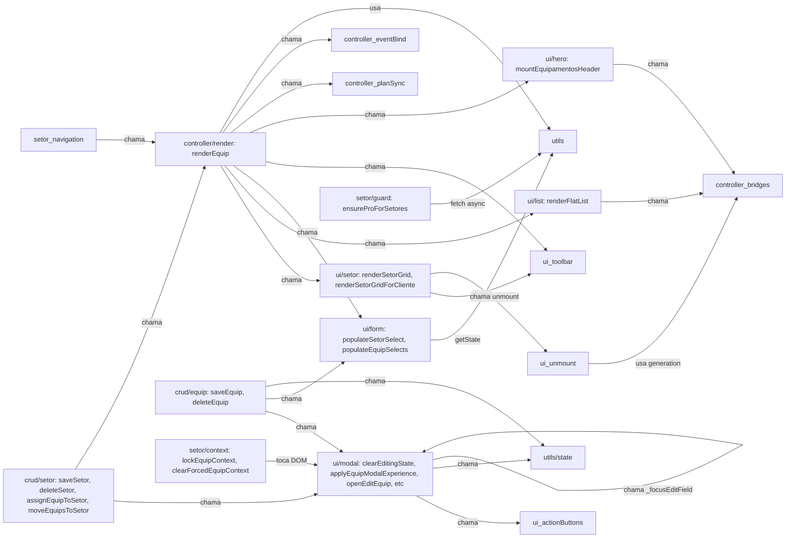

# Mudança 11 — Inventário de equipamentos.js

> Gerado em CP-A. Será atualizado a cada CP conforme funções saem do arquivo original.
> Última atualização: 2026-05-07 (CP-E — setor UI/state leve extraído).

## Métricas atuais

| Métrica                                                            |                                                                                                         Valor |
| ------------------------------------------------------------------ | ------------------------------------------------------------------------------------------------------------: |
| LOC total (pré-anotação JSDoc)                                     |                                                                                                          2746 |
| LOC total (pós-anotação JSDoc, fim do CP-A)                        |                                                                                                          2846 |
| LOC total (pós-CP-B, 7 fns extraídas)                              |                                                                                                          2613 |
| LOC total (pós-CP-B.5, state module-level extraído)                |                                                                                                          2612 |
| LOC total (pós-CP-C, render plan + React bridges extraídos)        |                                                                                                          2496 |
| LOC total (pós-CP-E.0, pré-split setor in-place)                   |                                                                                                          2540 |
| LOC total (pós-CP-E, setor UI/state leve extraído)                 |                                                                                                          2272 |
| Funções top-level declaradas                                       |                                                                                                            54 |
| Linhas com `@sliceTarget` simples                                  |                                                                                                            44 |
| Linhas com `@sliceSplit` (multi-destino)                           |                                                                                                            10 |
| Imports externos (linhas `^import`)                                |                                                                                                            41 |
| Chamadas a `getState/setState/findEquip/findSetor/regsForEquip`    |                                                                                                            26 |
| Chamadas diretas a Storage / Supabase / persist                    |                                                                                                             3 |
| Acessos a DOM (`document.*`, `querySelector`, `Utils.getEl`, etc.) |                                                                                                           184 |
| Funções `async`                                                    |                                                                                                            10 |
| God-functions (LOC > 100)                                          | 4 (`viewEquip` 448, `saveEquip` 234, `renderSetorGridForCliente` 147, `openEditEquip` 144, `renderEquip` 141) |

## Distribuição por categoria

Tally pela categoria **primária** (em `@sliceSplit` conta-se a primeira listada). Funções do tipo split aparecem também listadas em §"Funções com `@sliceSplit`" abaixo.

| Categoria         |                                                         Funções | LOC estimado |    % LOC |
| ----------------- | --------------------------------------------------------------: | -----------: | -------: |
| ui                |                                                              27 |        ~1471 |     ~62% |
| crud              |                                                               6 |         ~402 |     ~17% |
| controller        |                                                               7 |         ~214 |      ~9% |
| utils             |                              10 (7 movidas + 3 reclassificadas) |         ~206 |      ~9% |
| setor             |                                                               4 |          ~93 |      ~4% |
| nameplate         |                                    0 (só secundária em 1 split) |            — |        — |
| risco             |                                    0 (só secundária em 1 split) |            — |        — |
| filtros           | 0 (filtragem mora em `equipamentos/`, não no arquivo principal) |            — |        — |
| **Total funções** |                                                          **54** |    **~2386** | **100%** |

**Observações iniciais:**

- **`ui` domina absoluto (62% do LOC)** — esperado para uma god-view, mas significa que CP-G (UI) será o maior em volume.
- **`filtros/` já está extraída** pra `src/ui/views/equipamentos/` (módulo `helpers.js`, `equipmentCards.js`, `hero.js`, etc.). O arquivo principal não tem mais lógica de filtro pura — só orquestração de filtro via `_navigateEquipCtx` e `buildEquipamentosViewModel`. Isso simplifica o blueprint da Mudança 11: **categoria `filtros` pode ser desconsiderada como CP separado** ou virar um CP fino para extrair os helpers de "quick filter" residuais.
- **`risco/` aparece só como split em `viewEquip`** (linhas de risk panel). Pode virar uma sub-extração dentro de CP-G, não um CP próprio.
- **`nameplate/` aparece só como split em `openEditEquip`**. Idem: sub-extração, não CP próprio.

## Tabela completa das 54 funções

Convenção de **Side effects** (abrev.):

- `pure` — nenhum side effect
- `state` — getState / setState / módulo-level vars
- `DOM` — `document.*`, `Utils.getEl`, etc.
- `supabase` — chamada via Storage/Supabase
- `local` — localStorage / IndexedDB / nameplate metadata
- `async` — função async

Convenção de **Chamada por (n)**: número de chamadas internas ao arquivo. Fazer auditoria de chamadas externas é trabalho de CP-G (precondição pra remover fachadas).

|   # | Função                                   | Linha | LOC | Categoria              | Slice destino                           | Side effects                  | Obs                                 |
| --: | ---------------------------------------- | ----: | --: | ---------------------- | --------------------------------------- | ----------------------------- | ----------------------------------- |
|   1 | `syncComponenteVisibility`               |   115 |  12 | ui                     | ui/componente                           | DOM                           | Idempotent toggle                   |
|   2 | `loadEquipamentosHeaderBridge`           |   143 |   8 | controller             | controller/bridges                      | async, state                  | Lazy import memoizado               |
|   3 | `loadEquipamentosListBridge`             |   152 |   8 | controller             | controller/bridges                      | async, state                  | Lazy import memoizado               |
|   4 | `unmountEquipamentosHeader`              |   161 |  15 | ui                     | ui/unmount                              | DOM, state                    | Generation counter                  |
|   5 | `unmountEquipamentosList`                |   177 |  15 | ui                     | ui/unmount                              | DOM, state                    | Generation counter                  |
|   6 | `_bindRenderEquipPlanInvalidationEvents` |   193 |  11 | controller             | controller/eventBind                    | state                         | Bind global events 1x               |
|   7 | `_stripRenderInternalOptions`            |   205 |   4 | utils                  | utils/options                           | pure                          | Helper destructure                  |
|   8 | `_refreshRenderEquipPlan`                |   210 |  26 | controller             | controller/planSync                     | async, state, supabase        | Plan refresh assíncrono             |
|   9 | `getEditingEquipId`                      |   237 |   3 | utils                  | utils/state                             | state                         | Getter trivial                      |
|  10 | `setEquipActionButtonVisible`            |   241 |   7 | ui                     | ui/actionButtons                        | DOM                           | Show/hide button + row              |
|  11 | `setEquipActionFooterHintVisible`        |   249 |   4 | ui                     | ui/actionButtons                        | DOM                           | Toggle hint                         |
|  12 | `createActionTrayPlusIcon`               |   254 |  15 | ui                     | ui/svg                                  | DOM                           | SVG factory                         |
|  13 | `setEquipActionTrayButtonLabel`          |   270 |   6 | ui                     | ui/actionButtons                        | DOM                           | Update label + icon                 |
|  14 | `clearEditingState`                      |   276 |  40 | **ui** (split)         | ui/modal + crud/clear                   | DOM, state, local             | Reset modal+nameplate metadata      |
|  15 | `applyEquipModalExperience`              |   317 |  92 | **ui** (split)         | ui/modal + setor/context                | DOM, state                    | Plan-aware UX path explosion        |
|  16 | `clearForcedEquipContext`                |   410 |  15 | setor                  | setor/context                           | DOM, state                    | Clear locked context                |
|  17 | `lockEquipContext`                       |   427 |  47 | setor                  | setor/context                           | DOM, state                    | Lock cliente/setor                  |
|  18 | `getActiveQuickFilter`                   |   499 |   2 | utils                  | utils/state                             | state                         | Getter trivial                      |
|  19 | `setActiveQuickFilter`                   |   502 |   8 | controller             | controller/navigation                   | state                         | Navega quick filter                 |
|  20 | `_setToolbar`                            |   529 |  23 | ui                     | ui/toolbar                              | DOM                           | Title + actions                     |
|  21 | `mountEquipamentosHeader`                |   553 |  12 | controller             | controller/mount                        | async, DOM, state             | React bridge mount                  |
|  22 | `_lockedSetorBtnHtml`                    |   572 |  15 | ui                     | ui/setor                                | pure (HTML)                   | HTML factory                        |
|  23 | `populateSetorSelect`                    |   589 |  31 | ui                     | ui/form                                 | DOM, state                    | Setor dropdown                      |
|  24 | `setActiveSector`                        |   625 |  11 | setor                  | setor/navigation                        | state                         | Navega setor                        |
|  25 | `renderSetorGrid`                        |   638 |  39 | **ui** (split)         | ui/setor + controller/render            | DOM, state                    | Pro grid render                     |
|  26 | `renderSetorGridForCliente`              |   686 | 147 | **ui** (split)         | ui/setor + controller/render            | DOM, state                    | Bug fix #100 dual-path              |
|  27 | `buildEquipamentoListCardModel`          |   840 |  76 | utils                  | utils/cardModel                         | pure                          | ViewModel build                     |
|  28 | `buildReactListEmptyState`               |   917 |  37 | utils                  | utils/emptyState                        | pure                          | ViewModel build                     |
|  29 | `buildReactListViewModel`                |   955 |  18 | utils                  | utils/listModel                         | pure                          | ViewModel aggregate                 |
|  30 | `renderFlatList`                         |   975 |  62 | **ui** (split)         | ui/list + controller/render             | DOM, state, local             | React mount + skeleton              |
|  31 | `renderEquip`                            |  1038 | 141 | **controller** (split) | controller/render + ui/hero + ui/list   | async, DOM, state, supabase   | God-orchestrator. Pré-split em CP-G |
|  32 | `ensureProForSetores`                    |  1186 |  20 | setor                  | setor/guard                             | async, supabase, DOM          | Plan gate                           |
|  33 | `_setSaveBtnLabel`                       |  1211 |   7 | ui                     | ui/modal                                | DOM                           | Helper micro                        |
|  34 | `_setSetorNomeValidationState`           |  1218 |  11 | ui                     | ui/validation                           | DOM                           | Validation visual                   |
|  35 | `_syncSetorSaveButtonState`              |  1229 |   7 | ui                     | ui/validation                           | DOM                           | Sync save button                    |
|  36 | `getEditingSetorId`                      |  1240 |   3 | utils                  | utils/state                             | state                         | Getter trivial                      |
|  37 | `moveEquipsToSetor`                      |  1260 |  32 | crud                   | crud/move                               | state, async                  | Batch move                          |
|  38 | `clearSetorEditingState`                 |  1294 |  42 | ui                     | ui/modal                                | DOM, state                    | Reset setor form                    |
|  39 | `openEditSetor`                          |  1337 |  46 | ui                     | ui/modal                                | DOM, state                    | Open setor editor                   |
|  40 | `_syncSetorModalPreview`                 |  1389 |  49 | ui                     | ui/preview                              | DOM                           | Live preview                        |
|  41 | `_syncSetorModalCounters`                |  1438 |  21 | ui                     | ui/validation                           | DOM                           | Char counters                       |
|  42 | `initSetorColorPicker`                   |  1458 |  59 | ui                     | ui/colorPicker                          | DOM                           | Bind color picker                   |
|  43 | `saveSetor`                              |  1518 |  65 | **crud** (split)       | crud/setor + ui/modal                   | state, local, async           | CRUD + modal close                  |
|  44 | `deleteSetor`                            |  1584 |  28 | crud                   | crud/setor                              | state, local, async           | Delete + orphan equips              |
|  45 | `assignEquipToSetor`                     |  1617 |  18 | crud                   | crud/setor                              | state, async                  | Assign equip→setor                  |
|  46 | `openEditEquip`                          |  1669 | 144 | **ui** (split)         | ui/modal + nameplate                    | async, DOM, state, supabase   | Form pre-pop                        |
|  47 | `_focusEditField`                        |  1824 |  71 | ui                     | ui/modal                                | DOM                           | Expand+scroll+focus                 |
|  48 | `saveEquip`                              |  1896 | 234 | **crud** (split)       | crud/equip + ui/modal + controller/post | async, state, local, supabase | God-CRUD. Pré-split em CP-F         |
|  49 | `_eqDetailSubtitle`                      |  2137 |  10 | utils                  | utils/detail                            | pure (HTML)                   | Subtitle "Local · TAG"              |
|  50 | `_infoRowValueOrEmpty`                   |  2161 |  15 | utils                  | utils/detail                            | pure (HTML)                   | Row value or CTA                    |
|  51 | `_riskFactorChipHtml`                    |  2190 |  38 | utils                  | utils/detail                            | pure (HTML)                   | Risk factor chip                    |
|  52 | `viewEquip`                              |  2229 | 448 | **ui** (split)         | ui/detail + risco                       | async, DOM, supabase          | God-detail. Pré-split em CP-G       |
|  53 | `deleteEquip`                            |  2678 |  25 | crud                   | crud/equip                              | state, local, async           | Delete + cascade                    |
|  54 | `populateEquipSelects`                   |  2704 |  43 | ui                     | ui/form                                 | DOM, state                    | Selects + datalist                  |

## Funções com `@sliceSplit` (responsabilidades misturadas)

|   # | Função                      | Linha | LOC | Destinos                                | Estratégia de split                                                                                                                                                                                        |
| --: | --------------------------- | ----: | --: | --------------------------------------- | ---------------------------------------------------------------------------------------------------------------------------------------------------------------------------------------------------------- |
|  14 | `clearEditingState`         |   276 |  40 | ui/modal + crud/clear                   | Carve `crud/clear` (reset de `_editingEquipId` + nameplate metadata + `clearForcedEquipContext`). Resto fica em `ui/modal`.                                                                                |
|  15 | `applyEquipModalExperience` |   317 |  92 | ui/modal + setor/context                | Carve helper `_readForcedContext()` em `setor/context`. Mantém branching plan-aware em `ui/modal`.                                                                                                         |
|  25 | `renderSetorGrid`           |   638 |  39 | ui/setor + controller/render            | Mover orquestração (unmount, fetch state, set toolbar) pra `controller/render`. Render dos cards fica em `ui/setor`.                                                                                       |
|  26 | `renderSetorGridForCliente` |   686 | 147 | ui/setor + controller/render            | Idem 25, mais bug fix #100 dual-path filter. Maior split — vale commit dedicado dentro de CP-D.                                                                                                            |
|  30 | `renderFlatList`            |   975 |  62 | ui/list + controller/render             | Carve build de viewModel + skeleton wrapper pra `ui/list`. Mantém orquestração em `controller/render`.                                                                                                     |
|  31 | `renderEquip`               |  1038 | 141 | controller/render + ui/hero + ui/list   | God-orchestrator. **Pré-split em CP-G (ou CP-pré-split dedicado)**: hero render → `ui/hero`, list render → `ui/list`, route resolution stays em `controller/render`.                                       |
|  43 | `saveSetor`                 |  1518 |  65 | crud/setor + ui/modal                   | Carve persistencia (validate + state + storage + assign) pra `crud/setor`. Modal close + Toast em `ui/modal`.                                                                                              |
|  46 | `openEditEquip`             |  1669 | 144 | ui/modal + nameplate                    | Carve nameplate restore pra `nameplate/bridge`. Form pre-pop + open modal stays em `ui/modal`.                                                                                                             |
|  48 | `saveEquip`                 |  1896 | 234 | crud/equip + ui/modal + controller/post | God-CRUD. **Pré-split em CP-F**: persist (validate+state+storage+supabase) → `crud/equip`, modal cleanup → `ui/modal`, post-action dispatch (clone/register/pmoc/save-without-client) → `controller/post`. |
|  52 | `viewEquip`                 |  2229 | 448 | ui/detail + risco                       | God-detail. **Pré-split em CP-G** (commit dedicado): cover/hero/tech-sheet/timeline/footer chunks → `ui/detail/<chunk>.js`, risk panel computation → `risco/panel.js`.                                     |

## Top 3 god-functions (alvo de pré-split antes do CP correspondente)

1. **`viewEquip`** (line 2229, **448 LOC**) — 16% do arquivo inteiro. Detail modal: cover, hero, risk panel, tech sheet (13+ seções), timeline, footer com 3-action layout. Mistura: HTML strings, risk evaluation, photo handling, a11y attributes. **Recomendação:** commit dedicado em CP-G separando os chunks de HTML em sub-funções nomeadas (`buildCoverBlock`, `buildRiskPanel`, `buildTechSheet`, `buildTimelineBlock`, `buildFooterActions`) **antes** de mover pra `ui/detail/`.

2. **`saveEquip`** (line 1896, **234 LOC**) — Create/update + validation + photos + nameplate + 4 post-action branches. **Recomendação:** commit dedicado em CP-F separando: validate fn, persist fn, postActionDispatcher fn. Cada fn vai pra slice correto na extração.

3. **`renderEquip`** (line 1038, **141 LOC**) — Main orchestrator: hero, filters, setor grid (Pro), flat list (Free/drill-down), plan refresh async. **Recomendação:** extract `renderHero(state)` e `renderListOrGrid(ctx, options)` antes de mover. Diminui acoplamento entre ui/hero e ui/list.

## Top 3 hubs (mais chamadores internos)

(Análise rough via grep; auditoria precisa de AST. Útil pra identificar fachadas inevitáveis.)

1. **`_setToolbar`** — chamada em `renderSetorGrid`, `renderSetorGridForCliente`, `renderEquip` (2x branches), `applyEquipModalExperience` (indireto). ~5 chamadores. Provável vai pra `ui/toolbar` cedo (CP-G) e gerar fachada temporária.
2. **`_navigateEquipCtx`** (importada de `equipamentos/contextState.js`) — orchestra todas as transições de quick filter / setor / cliente. Chamada por `setActiveQuickFilter`, `setActiveSector`. Já está fora do arquivo, não afeta o blueprint.
3. **`getState()`** (importada de `core/state.js`) — chamada ~7+ vezes diretamente em `equipamentos.js`. Hub global do app, mantém-se fora.

## Top 3 orquestradores (mais chamadas para dentro)

1. **`renderEquip`** — chama `renderFlatList` (3x), `renderSetorGrid`, `renderSetorGridForCliente`, `mountEquipamentosHeader`, `populateSetorSelect`, `_refreshRenderEquipPlan`, `_setToolbar` (2x), `_resolveEquipCtx`, `_bindRenderEquipPlanInvalidationEvents`. Hub central de orquestração.
2. **`saveEquip`** — chama `validateEquipamentoPayload`, `setState`, `Storage.*`, `clearEditingState`, `clearForcedEquipContext`, `closeModal`, `Toast`, `viewEquip` (post-action), `populateEquipSelects`. Orquestra CRUD inteiro.
3. **`viewEquip`** — chama `findEquip`, `regsForEquip`, `evaluateEquipmentRisk`, `getSuggestedAction`, `EquipmentPhotos`, `_eqDetailSubtitle`, `_infoRowValueOrEmpty`, `_riskFactorChipHtml`, `Photos.*`. Detail render orchestrator.

## Funções "surpresa" (categoria diverge do nome)

| Função                        | Categoria esperada pelo nome | Categoria real                                   | Por quê                                                                                     |
| ----------------------------- | ---------------------------- | ------------------------------------------------ | ------------------------------------------------------------------------------------------- |
| `clearEditingState`           | crud (clear)                 | **ui (split com crud)**                          | "Clear" ≈ reset visual + reset metadata. UI domina (modal title, buttons, photos UI).       |
| `applyEquipModalExperience`   | ui/modal                     | **ui (split com setor/context)**                 | Lê `_forcedEquipContext` e enabled/disabled triggers de setor — depende de `setor/context`. |
| `_refreshRenderEquipPlan`     | utils ("refresh")            | **controller**                                   | Orquestra fetch billing + plan cache update + conditional re-render. Pure controller.       |
| `populateSetorSelect`         | ui/form (single concern)     | **ui/form (com side effect implícito)**          | Também chama `syncContextGroupVisibility()` — toca múltiplos containers além do `eq-setor`. |
| `_focusEditField`             | ui (focus)                   | **ui/modal (orquestração viewport)**             | Expande accordions, scrolls, focus, applica highlight CSS class. Não é só `.focus()`.       |
| `setEquipActionButtonVisible` | ui (visibility único)        | **ui/actionButtons (com side effect implícito)** | Também esconde a row pai (`closest('.action-tray__row')`).                                  |

## Código morto candidato a remoção (CP-H)

Funções **sem chamador interno aparente + não exportadas** (auditoria leve via grep — confirmar com AST/tree-shaker antes de deletar).

| Função                                                  | Linha | LOC | Confidence | Notas                                                                    |
| ------------------------------------------------------- | ----: | --: | ---------- | ------------------------------------------------------------------------ |
| _(nenhum candidato claro identificado nesta auditoria)_ |     — |   — | —          | A maior parte das funções privadas (`_*`) tem ao menos 1 chamador local. |

**Observação:** ausência de candidatos claros é um sinal positivo — o god-object não acumulou helpers órfãos significativos. Confirmar via AST em CP-H.

## Mapa de dependências cruzadas (categoria → categoria)

Apenas chamadas internas observáveis no arquivo. Setas com count = 0 omitidas.

**Leitura:** `controller/render` (renderEquip) é o **hub** com setas pra quase todas as categorias UI. CRUD chama UI e controller. UI raramente chama CRUD direto (boa). Setor cruza controller e UI. Implica:

1. **Ordem recomendada de extração:**
   - **CP-B** `utils/` primeiro (zero dependência inversa)
   - **CP-C** `controller/bridges` + `controller/eventBind` + `controller/planSync` (low coupling, pré-requisito de unmount)
   - **CP-D** `setor/` (acopla `controller/render` mas via fachada simples)
   - **CP-E** `crud/equip` + `crud/setor` (depende de utils + setor já extraídos)
   - **CP-F** **pré-split de `saveEquip`** + extração `ui/modal` parcial
   - **CP-G** **pré-split de `viewEquip`** + extração `ui/*` em peso
   - **CP-H** limpeza, remover fachadas, dead code

2. **`renderEquip` precisa de pré-split antes de qualquer extração de `ui/*`** — senão a fachada que ele vai gerar fica monstruosa (3 categorias). Recomendar **CP-pré-render-split** entre CP-D e CP-E.

## Estimativa atualizada de LOC por slice

(Ranges iniciais não disponíveis — `mudanca-11-plano-master.md` não está commitado neste branch. Reportando valores reais medidos em CP-A.)

| Categoria/slice                                                                                                                              |                           LOC real (CP-A) | Notas                                                                                 |
| -------------------------------------------------------------------------------------------------------------------------------------------- | ----------------------------------------: | ------------------------------------------------------------------------------------- |
| utils (todas variantes: state, options, cardModel, emptyState, listModel, detail)                                                            |                                      ~206 | Pequeno; saí num CP.                                                                  |
| controller (bridges + eventBind + planSync + navigation + mount + render)                                                                    |          ~214 (sem renderEquip pré-split) | Após pré-split de renderEquip, esse cresce ~+80.                                      |
| setor (context + navigation + guard)                                                                                                         |                                       ~93 | Pequeno; saí num CP, **mas depende de controller/render pra fechar fachada**.         |
| crud (equip + setor + move)                                                                                                                  | ~402 (com saveEquip e saveSetor inteiros) | Após pré-split de saveEquip, esse fica em ~250 LOC reais e ~150 LOC vão pra ui/modal. |
| ui (toolbar + actionButtons + svg + form + setor + componente + colorPicker + preview + validation + modal + list + detail + unmount + hero) |                                     ~1471 | Maior. Vai precisar de **2 CPs** (CP-F pré-split + CP-G principal).                   |
| nameplate                                                                                                                                    |    <50 LOC (só na slice de openEditEquip) | Pode ficar com ui/modal, sem CP próprio.                                              |
| risco                                                                                                                                        |       <100 LOC (só na slice de viewEquip) | Pode ficar com ui/detail, sem CP próprio.                                             |
| filtros                                                                                                                                      |       0 (já extraído pra `equipamentos/`) | **Pular CP de filtros.**                                                              |

## Notas pro plano-master

Descobertas em CP-A que afetam a estratégia:

1. **`filtros/` já não existe no arquivo principal.** O blueprint da Mudança 11 §2 do plano-master deve **remover esse CP** e redistribuir os esforços. Se o plano-master listar `filtros/` como CP separado, atualizar pra "extraído pre-CP-A em `src/ui/views/equipamentos/`".

2. **`nameplate/` e `risco/` são sub-categorias, não CPs próprios.** Apenas 1 função cada toca essas concerns como split secundário. Recomendar:
   - `nameplate/bridge` extraído como parte do CP que extrai `openEditEquip` (CP-F ou CP-G).
   - `risco/panel` extraído como parte do CP que extrai `viewEquip` (CP-G).

3. **3 god-functions concentram >38% do LOC** (`viewEquip` 448, `saveEquip` 234, `renderEquip` 141, `renderSetorGridForCliente` 147, `openEditEquip` 144). Extrair sem pré-split vai gerar fachadas grandes e PRs review-hostis. **Recomendar CP-pré-split dedicado** antes do CP de UI principal — pode ser:
   - CP-F.0: pré-split de `saveEquip` (carve `validate`, `persist`, `postActionDispatch`)
   - CP-G.0: pré-split de `viewEquip` (carve cada chunk de HTML em fn nomeada)
   - CP-G.1: pré-split de `renderEquip` (carve `renderHero`, `renderListOrGrid`)

4. **`controller/render` é hub** de quase tudo. Ordem das extrações precisa preservar `renderEquip` no arquivo principal **até o último CP** — senão todas as outras extrações ficam orfãs do orquestrador e reaparecem como imports cruzados.

5. **Sem código morto óbvio.** Bom sinal — o god-object é "denso", não inflado de helpers órfãos. CP-H provavelmente vai ser pequeno (ajustes de fachada).

6. **State global (module-level) é significativo.** Variáveis `_editingEquipId`, `_editingSetorId`, `_forcedEquipContext`, plus 3 generation counters e 4 promises memoizadas. Considerar extração desses pra `state/editingState.js` e `state/bridgeState.js` num CP dedicado (entre CP-B e CP-C). Sem isso, qualquer extração de `crud/` ou `controller/bridges` precisa importar essas vars do arquivo central, mantendo acoplamento.

7. **React bridges são padrão consistente** — `loadEquipamentosHeaderBridge` e `loadEquipamentosListBridge` seguem o mesmo template. Pode virar 1 helper `createReactBridgeLoader(name, importFn)` em `controller/bridges` que substitui ambos. Reduz ~16 LOC e padroniza.

## Lições do CP-B (utils)

- **LOC real removido:** ~233 (vs estimado ~206 inicial — diferença vem do `EQUIP_TONE_LABELS` const + 5 imports especializados que saíram junto). Estimativa do plano-master se mostrou conservadora; OK.
- **Reclassificações descobertas:** 3 funções marcadas `@sliceTarget utils/state` no CP-A foram **reclassificadas** pra `state/editingState` em CP-B porque leem state module-level (critério de pureza falhou):
  - `getEditingEquipId` — lê `_editingEquipId`
  - `getEditingSetorId` — lê `_editingSetorId`
  - `getActiveQuickFilter` — lê via `_getRouteEquipCtx()` (importado de `./equipamentos/contextState.js`)
  - **Implicação:** categoria `utils/state` planejada inicialmente não existe — todas as 3 vão pra `state/editingState` num **CP novo (CP-B.5)**, fold com extração das vars module-level (`_editingEquipId`, `_editingSetorId`, generation counters, promises memoizadas).
- **Surpresas:** zero. As 7 funções `utils` movíveis caíram em 2 famílias claras (viewModels + detail HTML helpers); 3 arquivos seria over-engineering. Distribuição final: 4 em `viewModels.js`, 3 em `detail.js`.
- **Tempo gasto:** 1 turno Claude Code (estimado: 1–2). ✓
- **Imports limpados:** 11 imports em `equipamentos.js` ficaram unused após o move (os que só serviam pras funções movidas) — removidos no mesmo PR. Sintoma esperado, não regressão.
- **Tests:** 28 novos casos (16 em `detail.test.js` + 12 em `viewModels.test.js`). Esperado ≥14 (7 fns × 2). Cobertura mais alta porque algumas fns têm múltiplos branches.
- **Riscos que motivaram CP-B.5:** As 3 fns reclassificadas leem state via 2 mecanismos distintos:
  - direto (`_editingEquipId`, `_editingSetorId` — vars que estavam locais a `equipamentos.js`)
  - via import (`_getRouteEquipCtx` — vem de `./equipamentos/contextState.js`)
  - **Decisão aplicada no CP-B.5:** extrair `_editingEquipId`/`_editingSetorId` para `state/editingState.js`, extrair `_forcedEquipContext` junto por pertencer ao mesmo fluxo de contexto de edição, e mover `getActiveQuickFilter` para `equipamentos/contextState.js` por ser leitura direta de route context.

## Lições do CP-B.5 (state module-level)

- **Escopo aplicado:** extraído somente state module-level de edição/contexto e state de cache/generation dos React bridges. Render plan permaneceu no god-object para o CP-C.
- **Arquivos criados:**
  - `src/features/equipamentos/state/editingState.js` — encapsula `_editingEquipId`, `_editingSetorId` e `_forcedEquipContext` com getters/setters simples.
  - `src/features/equipamentos/state/bridgeState.js` — encapsula promises memoizadas, bridges carregadas e generation counters de header/list.
- **Vars movidas:** `_editingEquipId`, `_editingSetorId`, `_forcedEquipContext`, `_equipamentosHeaderBridgePromise`, `_equipamentosHeaderBridge`, `_equipamentosHeaderRenderGeneration`, `_equipamentosListBridgePromise`, `_equipamentosListBridge`, `_equipamentosListRenderGeneration`.
- **Decisão `getActiveQuickFilter`:** movida para `src/ui/views/equipamentos/contextState.js`, porque a leitura já depende exclusivamente de `getRouteEquipCtx()`. `src/ui/views/equipamentos.js` preserva o export público via re-export. `setActiveQuickFilter` permaneceu em `equipamentos.js` por ser controller/navigation.
- **LOC real em `equipamentos.js`:** 2613 → 2612 (delta -1). O delta pequeno é esperado porque getters/setters/imports substituem acesso direto sem mover bridge functions neste CP.
- **Tests adicionados:**
  - `src/features/equipamentos/__tests__/state/editingState.test.js` — 6 testes.
  - `src/features/equipamentos/__tests__/state/bridgeState.test.js` — 9 testes.
  - `src/__tests__/equipamentosContextState.test.js` — 2 testes para `getActiveQuickFilter`.
- **Ainda no god-object para CP-C:** `_renderEquipPlanToken`, `_renderEquipPlanNeedsRefresh`, `_renderEquipPlanEventsBound`, `_renderEquipPlanRefreshPromise`, `_bindRenderEquipPlanInvalidationEvents`, `_refreshRenderEquipPlan`, `loadEquipamentosHeaderBridge` e `loadEquipamentosListBridge`.
- **Próximo CP:** CP-C — mover render plan + React bridge functions preservando dynamic imports e facade pública.

## Estado por categoria (atualizar a cada CP)

| Categoria          | Status                                  | CP que extraiu | LOC removido |           Funções movidas |
| ------------------ | --------------------------------------- | -------------- | -----------: | ------------------------: |
| utils              | ✅ extraído (7) + reclassificado (3)    | CP-B           |         ~233 |            7 / 7 movíveis |
| state/editingState | ✅ extraído (editing/context state)     | CP-B.5         |           ~3 |                     3 / 3 |
| controller         | 📦 inventariado (bridge state extraído) | —              |            0 |                     0 / 7 |
| setor              | ✅ UI/state leve extraído               | CP-E           |         ~268 |               8 / 8 leves |
| crud               | 📦 inventariado                         | —              |            0 |                     0 / 6 |
| ui                 | 📦 inventariado                         | —              |            0 |                    0 / 27 |
| nameplate          | 📦 inventariado (split-only)            | —              |            0 |  0 / 0 (fold em ui/modal) |
| risco              | 📦 inventariado (split-only)            | —              |            0 | 0 / 0 (fold em ui/detail) |
| filtros            | ✅ pré-extraído (já em `equipamentos/`) | pré-CP-A       |            — |                     0 / 0 |

**Legenda:**

- 📦 inventariado — anotado, não movido
- 🚧 em extração — CP atual está movendo
- ✅ extraído — todas as funções da categoria saíram do arquivo original
- 🧹 fachada removida — call sites externos atualizados, fachada deletada

## Atualização CP-C — Render plan + React bridges (2026-05-07)

Status: **CP-C aplicado**.

### Arquivos criados

- `src/features/equipamentos/state/renderPlanState.js`
- `src/features/equipamentos/bridges/renderPlan.js`
- `src/features/equipamentos/bridges/headerBridge.js`
- `src/features/equipamentos/bridges/listBridge.js`

### Movimentos realizados

- Vars de render plan movidas de `src/ui/views/equipamentos.js` para `state/renderPlanState.js`:
  - `_renderEquipPlanToken`
  - `_renderEquipPlanNeedsRefresh`
  - `_renderEquipPlanEventsBound`
  - `_renderEquipPlanRefreshPromise`
- Funções de render plan movidas para `bridges/renderPlan.js`:
  - `_bindRenderEquipPlanInvalidationEvents` → `bindRenderEquipPlanInvalidationEvents`
  - `_refreshRenderEquipPlan` → `refreshRenderEquipPlan`
- Bridge functions movidas para módulos dedicados:
  - `loadEquipamentosHeaderBridge`, `mountEquipamentosHeader`, `unmountEquipamentosHeader` → `bridges/headerBridge.js`
  - `loadEquipamentosListBridge`, `unmountEquipamentosList` e montagem React da lista → `bridges/listBridge.js`
- Dynamic imports React saíram do adapter legado `src/ui/views/equipamentos.js` e ficaram restritos aos bridges:
  - `../../../react/entrypoints/equipamentosHeaderIsland.jsx`
  - `../../../react/entrypoints/equipamentosListIsland.jsx`
- `src/ui/views/equipamentos.js` permanece como adapter legado desse cluster e continua mantendo as god-functions fora do escopo:
  - `renderEquip`
  - `saveEquip`
  - `viewEquip`
  - setor, CRUD, modal, form, detail e UI list/card legados

### LOC

| Arquivo                        | Antes CP-C | Depois CP-C | Delta |
| ------------------------------ | ---------: | ----------: | ----: |
| `src/ui/views/equipamentos.js` |       2612 |        2496 |  -116 |

### Testes adicionados/alterados

- Adicionados:
  - `src/features/equipamentos/__tests__/state/renderPlanState.test.js`
  - `src/features/equipamentos/__tests__/bridges/renderPlan.test.js`
  - `src/features/equipamentos/__tests__/bridges/headerBridge.test.js`
  - `src/features/equipamentos/__tests__/bridges/listBridge.test.js`
- Alterados:
  - `src/__tests__/equipamentosHeaderIsland.test.jsx`
  - `src/__tests__/equipamentosReactListIsland.test.jsx`

### Próximo CP recomendado

**CP-E — setor**. Se `renderSetorGridForCliente` estiver misturado demais para mover com fachada pequena e segura, executar antes um **CP-E.0 pré-split** focado em separar a orquestração de render do setor sem mover CRUD, modal ou `renderEquip`.

## Atualização CP-E.0 — Setor preflight + pré-split in-place (2026-05-07)

Status: **CP-E.0 aplicado com pré-split in-place**.

### Decisão

`renderSetorGridForCliente` precisava de pré-split antes do CP-E porque tinha ~158 LOC e misturava:

- orquestração de render legado (`#lista-equip`, unmount React);
- leitura de state (`setores`, `equipamentos`);
- chrome/toolbar da tela por cliente;
- filtro dual-path de setores por cliente;
- montagem de HTML de estado vazio, banner `Sem setor`, cards e tile `Sem setor`.

CP-E agora pode mover o cluster de setor com fachada menor, desde que preserve o adapter legado e extraia somente setor para `src/features/equipamentos/setor/` no próximo checkpoint.

### Funções criadas em `src/ui/views/equipamentos.js`

| Função                                | LOC aprox | Destino futuro                        | Observação                                                   |
| ------------------------------------- | --------: | ------------------------------------- | ------------------------------------------------------------ |
| `_prepareSetorGridForClienteShell`    |       ~26 | `setor/setorUI` + `controller/render` | Esconde search/view toggle e configura toolbar por cliente.  |
| `_buildSetorGridForClienteModel`      |       ~30 | `setor/setorState`                    | Mantém filtro dual-path e cálculo de equipamentos sem setor. |
| `_renderSetorGridForClienteHtml`      |       ~47 | `setor/setorUI`                       | Decide entre empty state e grade; preserva markup final.     |
| `_renderSetorGridForClienteEmptyHtml` |       ~81 | `setor/setorUI`                       | Isola HTML do estado vazio por cliente e banner `Sem setor`. |

### LOC

| Função                      | Antes CP-E.0 | Depois CP-E.0 | Delta |
| --------------------------- | -----------: | ------------: | ----: |
| `renderSetorGridForCliente` |         ~158 |           ~18 |  -140 |

| Arquivo                        | Antes CP-E.0 | Depois CP-E.0 | Delta |
| ------------------------------ | -----------: | ------------: | ----: |
| `src/ui/views/equipamentos.js` |        ~2496 |         ~2540 |   +44 |

O aumento líquido é esperado: o checkpoint adicionou JSDoc de slice e separou blocos sem mover código para novos módulos.

### Comportamento preservado

- Sem mudança de UX, classes, IDs, `data-action`, `data-id`, rotas ou contratos externos.
- `renderSetorGridForCliente` continua sendo chamado pelo branch Pro com cliente em `renderEquip`.
- Filtro dual-path de setores por cliente preservado.
- Estado vazio de setor por cliente preservado.
- Tile/banner `Sem setor` preservados.
- Nenhuma função de setor foi movida para `src/features/equipamentos/setor/` neste CP.
- `saveSetor`, `deleteSetor`, `assignEquipToSetor`, `renderEquip`, `saveEquip` e `viewEquip` não foram movidos.

### Testes adicionados/alterados

Alterado `src/__tests__/equipamentosLegacyRender.test.js` com testes de caracterização para:

- estado vazio de setores por cliente, incluindo CTA `open-setor-modal`, banner/link `__sem_setor__`, toolbar e ocultação de busca/toggle;
- grade de setores por cliente, incluindo card de setor, ações `edit-setor`, `toggle-setor-menu`, `delete-setor`, tile `Sem setor` e `data-cliente-id`.

### Próximo CP recomendado

**CP-E — extrair setor para `src/features/equipamentos/setor/`**.

Sugestão de destino inicial:

- `setor/setorUI`: `_lockedSetorBtnHtml`, `renderSetorGrid`, `_prepareSetorGridForClienteShell`, `_renderSetorGridForClienteHtml`, `_renderSetorGridForClienteEmptyHtml` e integração com `setorCardHtml`.
- `setor/setorState`: `_buildSetorGridForClienteModel`, `setActiveSector`, contexto forçado relacionado a setor se mantido no recorte.
- `setor/setorPersist`: somente em CP posterior ou subpasso explícito, porque `saveSetor`, `deleteSetor`, `moveEquipsToSetor` e `assignEquipToSetor` tocam state/storage/toast/render e merecem fachada cuidadosa.

## Atualização CP-E — Setor UI/state leve extraído (2026-05-07)

Status: **CP-E aplicado**.

### Arquivos criados

- `src/features/equipamentos/setor/setorState.js`
- `src/features/equipamentos/setor/setorUI.js`
- `src/features/equipamentos/setor/setorNavigation.js`
- `src/features/equipamentos/__tests__/setor/setorState.test.js`
- `src/features/equipamentos/__tests__/setor/setorUI.test.js`
- `src/features/equipamentos/__tests__/setor/setorNavigation.test.js`

### Funções movidas

| Função                                | Origem                         | Destino                                              | Observação                                                                 |
| ------------------------------------- | ------------------------------ | ---------------------------------------------------- | -------------------------------------------------------------------------- |
| `_lockedSetorBtnHtml`                 | `src/ui/views/equipamentos.js` | `src/features/equipamentos/setor/setorUI.js`         | Helper de HTML puro mantido para recorte de UI de setor.                   |
| `renderSetorGrid`                     | `src/ui/views/equipamentos.js` | `src/features/equipamentos/setor/setorUI.js`         | Usa dependências injetadas por `configureSetorUI`; sem import circular.    |
| `renderSetorGridForCliente`           | `src/ui/views/equipamentos.js` | `src/features/equipamentos/setor/setorUI.js`         | Orquestra shell + model + HTML com assinatura preservada.                  |
| `_prepareSetorGridForClienteShell`    | `src/ui/views/equipamentos.js` | `src/features/equipamentos/setor/setorUI.js`         | Mantém ocultação de busca/toggle e toolbar por cliente.                    |
| `_buildSetorGridForClienteModel`      | `src/ui/views/equipamentos.js` | `src/features/equipamentos/setor/setorState.js`      | Exportada como `buildSetorGridForClienteModel`; preserva filtro dual-path. |
| `_renderSetorGridForClienteHtml`      | `src/ui/views/equipamentos.js` | `src/features/equipamentos/setor/setorUI.js`         | Mantém grade, card de setor e tile `Sem setor`.                            |
| `_renderSetorGridForClienteEmptyHtml` | `src/ui/views/equipamentos.js` | `src/features/equipamentos/setor/setorUI.js`         | Mantém estado vazio, CTA `open-setor-modal` e link `__sem_setor__`.        |
| `setActiveSector`                     | `src/ui/views/equipamentos.js` | `src/features/equipamentos/setor/setorNavigation.js` | Navegação simples com `getRouteEquipCtx`/`navigateEquipCtx` injetados.     |

### Funções que permaneceram no adapter legado

- `saveSetor`: permanece por tocar validação, `setState`, modal, toast e `renderEquip`.
- `deleteSetor`: permanece por tocar plano Pro, `setState`, `Storage.markSetorDeleted`, navegação, toast e `renderEquip`.
- `moveEquipsToSetor`: permanece por mutar equipamentos/setores e acoplar fluxo de vínculo/movimentação.
- `assignEquipToSetor`: permanece por tocar `findEquip`, plano Pro, `setState`, toast e `renderEquip`.
- `populateSetorSelect`: permanece no adapter por pertencer ao form/modal e chamar `syncContextGroupVisibility()`.
- `clearForcedEquipContext` e `lockEquipContext`: permanecem no adapter porque manipulam selects/triggers/resumo do modal de equipamento e o estado de edição/contexto; melhor mover em CP de form/modal/context.
- `renderEquip`, `saveEquip`, `deleteEquip`, `viewEquip`, modal/form/list/detail gerais permanecem no adapter.

### LOC

| Arquivo                        | Antes CP-E | Depois CP-E | Delta |
| ------------------------------ | ---------: | ----------: | ----: |
| `src/ui/views/equipamentos.js` |       2540 |        2272 |  -268 |

### Testes adicionados/alterados

- `src/features/equipamentos/__tests__/setor/setorState.test.js`: 4 testes para filtro direto por `clienteId`, fallback via equipamento, equipamentos sem setor e cliente vazio.
- `src/features/equipamentos/__tests__/setor/setorUI.test.js`: 5 testes para empty state por cliente, CTA `open-setor-modal`, tile/link `__sem_setor__`, card de setor e empty state global.
- `src/features/equipamentos/__tests__/setor/setorNavigation.test.js`: 2 testes para navegação para setor e retorno ao grid preservando cliente.
- `src/__tests__/equipamentosLegacyRender.test.js`: sem alteração; mantido como caracterização do adapter legado.

### Riscos e conformidade

- Não foram movidas persistências pesadas de setor (`saveSetor`, `deleteSetor`, `moveEquipsToSetor`, `assignEquipToSetor`).
- `setorUI.js` não importa `src/ui/views/equipamentos.js`; dependências legadas entram por `configureSetorUI`.
- `setorNavigation.js` não importa `src/ui/views/equipamentos.js`; roteamento entra por `configureSetorNavigation`.
- Não houve CSS, schema/migration, `package.json`, `package-lock.json`, dependência nova, barrel `index.js` ou `test.skip`.

### Próximo CP recomendado

**CP-E.1 — persistência de setor: `saveSetor`/`deleteSetor`/`moveEquipsToSetor`/`assignEquipToSetor`**.

Justificativa: após a extração da UI/state leve, o próximo cluster coeso de setor é CRUD/persistência. Ele deve ser isolado em CP próprio porque toca plano Pro, `setState`, Storage/Supabase, modal, toasts e `renderEquip`.
