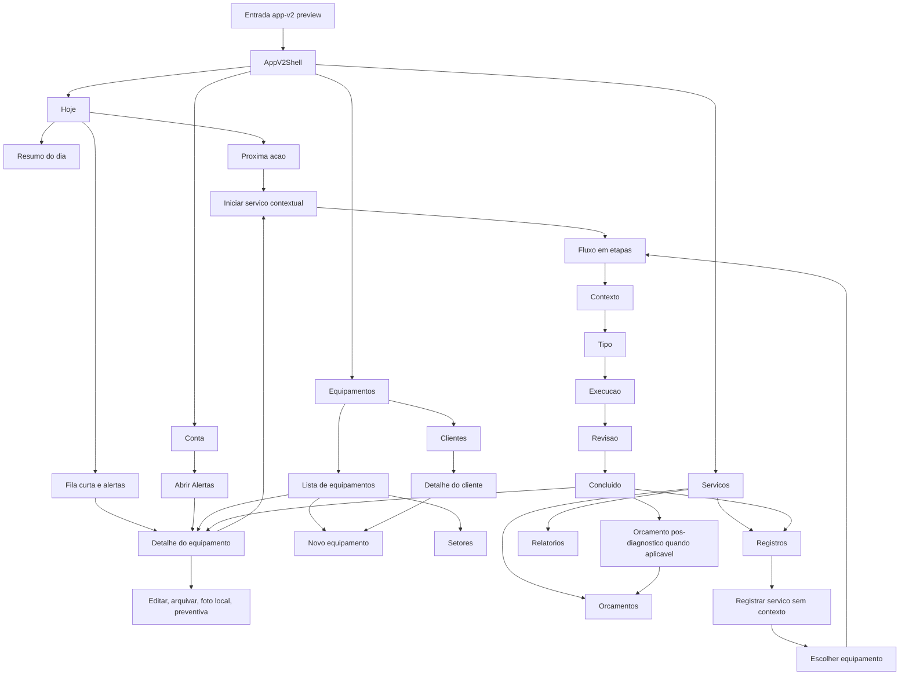

# app-v2 - Jornada atual do usuario e pontos de friccao

## 1. Objetivo

Mapear como o usuario navega hoje pelo app-v2, desde a entrada ate as tarefas
operacionais principais, para identificar gargalos de navegacao, reduzir friccao
e orientar proximas melhorias de usabilidade.

Este documento e uma analise do estado atual. Ele nao altera runtime, layout,
storage, contratos publicos, PDF/share, WhatsApp, Supabase/RLS ou billing.

## 2. Fontes analisadas

- `src/app-v2/preview.html`
- `src/app-v2/preview.tsx`
- `src/app-v2/shell/AppV2Shell.tsx`
- `src/app-v2/navigation/BottomNav.tsx`
- `src/app-v2/data/appV2MockData.ts`
- `src/app-v2/data/appV2Selectors.ts`
- `src/app-v2/data/appV2Actions.ts`
- `src/app-v2/home/HomeToday.tsx`
- `src/app-v2/alerts/AlertsHome.tsx`
- `src/app-v2/equipment/EquipmentList.tsx`
- `src/app-v2/equipment/EquipmentDetail.tsx`
- `src/app-v2/equipment/ClientList.tsx`
- `src/app-v2/equipment/ClientDetail.tsx`
- `src/app-v2/service/ServicesHome.tsx`
- `src/app-v2/service/ServiceEquipmentChoice.tsx`
- `src/app-v2/service/ServiceFlow.tsx`
- `src/app-v2/service/ServiceReportsHome.tsx`
- `src/app-v2/service/ServicesQuotesHome.tsx`
- `src/app-v2/account/AccountHome.tsx`

## 3. Modelo atual de navegacao

O app-v2 e montado pela pagina dedicada `src/app-v2/preview.html`, que carrega
`preview.tsx` e monta `AppV2Shell`.

A navegacao principal e controlada por estado local em `AppV2Shell`, nao por
rotas de URL. O usuario enxerga quatro areas principais:

1. `Hoje`
2. `Equipamentos`
3. `Servicos`
4. `Conta`

No desktop, essas areas aparecem na sidebar. No mobile, aparecem no bottom nav.

Ha tambem estados internos que funcionam como subrotas:

- `Hoje > Alertas`
- `Equipamentos > Equipamentos`
- `Equipamentos > Clientes`
- `Equipamentos > Detalhe do equipamento`
- `Equipamentos > Detalhe do cliente`
- `Servicos > Escolher equipamento`
- `Servicos > Fluxo de registro`
- `Servicos > Registros`
- `Servicos > Relatorios`
- `Servicos > Orcamentos`

## 4. Mapa da jornada atual

## 5. Jornadas principais

### 5.1 Tecnico entra para decidir o que fazer agora

Fluxo atual:

1. Usuario abre app-v2.
2. Cai em `Hoje`.
3. Ve resumo do dia, proxima acao e fila curta.
4. Pode abrir equipamento ou iniciar servico contextual.

Ponto positivo:

- `Hoje` ja atua como painel de prioridade e reduz a necessidade de procurar
  manualmente o primeiro atendimento.

Friccao atual:

- Alertas existe, mas nao aparece como item de navegacao principal. O usuario
  so chega ali por estado interno/atalho, entao a descoberta e baixa.

Melhoria recomendada:

- Manter `Alertas` como subvisao de `Hoje`, nao como quinta area principal nem
  rota propria nesta fase. Expor um acesso contextual dentro de `Hoje`,
  priorizando o CTA "Ver alertas" quando houver alertas ativos.
- A tela `Alertas` deve servir para triagem de anormalidades e abertura do
  Equipamento afetado, nao para resolver alerta como entidade isolada.
- O CTA de `Alertas` deve ter destaque condicional: com alertas ativos, mostrar
  chamada visivel com contagem e severidade; sem alertas ativos, manter apenas
  sinal secundario ou estado "Tudo em dia", sem competir com a Proxima acao.
- Quando a Proxima acao ja representar o alerta mais grave, `Alertas` continua
  como atalho secundario para triagem da lista completa. A Proxima acao segue
  como caminho primario para agir.

### 5.2 Tecnico quer registrar servico a partir de um equipamento

Fluxo atual:

1. Usuario abre `Equipamentos`.
2. Abre detalhe de um equipamento.
3. Clica para iniciar servico.
4. Vai para `Servicos > Fluxo de registro`.
5. Passa por Contexto, Tipo, Execucao, Revisao e Concluido.
6. Ao concluir, pode voltar para Servicos, abrir equipamento ou, quando o
   atendimento for diagnostico/proxima etapa, iniciar Orcamento pos-diagnostico.

Ponto positivo:

- Entrada contextual por equipamento esta coberta e preserva o sentido
  operacional do tecnico.

Friccao atual:

- O usuario sai visualmente de `Equipamentos` para `Servicos`, mas essa mudanca
  pode parecer brusca se o contexto do equipamento nao estiver sempre evidente
  no topo do fluxo.

Melhoria recomendada:

- Garantir que o cabecalho da etapa de servico mantenha nome do equipamento,
  cliente/local e um caminho de retorno claro para o detalhe do equipamento.

### 5.3 Tecnico quer registrar servico sem saber o equipamento primeiro

Fluxo atual:

1. Usuario abre `Servicos`.
2. Clica para registrar servico.
3. App abre `Escolher equipamento`.
4. Se houver equipamentos, seleciona e inicia o fluxo.
5. Se nao houver equipamentos, app orienta ir para `Equipamentos`.
6. Ao criar equipamento nesse contexto, o app volta automaticamente para o fluxo
   de servico.

Ponto positivo:

- O caso sem equipamento cadastrado ja tem continuidade e nao deixa o usuario
  preso.

Friccao atual:

- A criacao de equipamento durante o registro muda o usuario para outra area.
  Mesmo com retorno automatico, pode haver perda de contexto se a tela nao
  sinalizar que ele esta criando o equipamento "para registrar um servico".

Melhoria recomendada:

- Quando `startServiceAfterEquipmentCreate` estiver ativo, mostrar um banner no
  cadastro de equipamento indicando que, ao salvar, o usuario voltara ao
  registro do servico.
- Tratar esse caso como **criacao contextual de equipamento**: criacao de
  Equipamento iniciada porque o usuario tentou registrar servico sem equipamento
  adequado. A tela deve explicar que salvar o Equipamento retoma o Registro de
  servico.
- Anti-escopo: nao transformar em wizard novo, nao criar router, nao persistir
  essa intencao fora da sessao local e nao misturar com storage real.

### 5.4 Usuario gerencia equipamentos, setores e clientes

Fluxo atual:

1. Usuario entra em `Equipamentos`.
2. Alterna entre subvisoes `Equipamentos` e `Clientes`.
3. Em equipamentos, pode criar equipamento, gerenciar setores e abrir detalhes.
4. No detalhe, pode editar, arquivar/desarquivar, adicionar foto local e agendar
   preventiva.
5. Em clientes, pode criar cliente, abrir detalhe e criar equipamento vinculado.

Ponto positivo:

- Equipamentos, setores e clientes ja estao no mesmo dominio operacional.

Friccao atual:

- O item principal no mobile aparece como `Equipamento`, enquanto no desktop
  aparece como `Equipamentos`. Essa diferenca de rotulo pode gerar microfriccao.
- `Setores` e `Clientes` competem por atencao dentro de `Equipamentos`; para um
  tecnico em campo, a prioridade pode ser "achar equipamento rapido".

Melhoria recomendada:

- Padronizar o rotulo principal para `Equipamentos`.
- Priorizar busca/filtro de equipamento antes de configuracoes de setor quando a
  tela for usada como entrada operacional.

### 5.5 Usuario consulta registros, relatorios e orcamentos

Fluxo atual:

1. Usuario entra em `Servicos`.
2. Subvisao inicial e `Registros`.
3. Pode filtrar registros por periodo, cliente, equipamento, tipo e status.
4. Pode abrir `Relatorios`, consultar lista, preview e imprimir.
5. Pode abrir `Orcamentos`, editar rascunhos locais, aplicar modelos e ajustar
   itens/condicoes.

Ponto positivo:

- Os tres artefatos pos-atendimento estao agrupados em `Servicos`.

Friccao atual:

- `Servicos` concentra registro, relatorio e orcamento. Isso e coerente, mas
  pode ficar denso quando o usuario quer uma tarefa simples, como "continuar o
  atendimento atual" ou "ver orcamento".
- `Orcamentos` nao aparece na navegacao principal; o acesso depende de entrar em
  `Servicos` ou usar atalho em `Conta`.
- O plano inicial misturava orcamento criado apos servico concluido com
  orcamento criado antes da execucao. Para reduzir friccao, a jornada precisa
  diferenciar **orcamento pre-servico** e **orcamento pos-diagnostico**.

Melhoria recomendada:

- Manter `Orcamentos` como subvisao de `Servicos`.
- Tratar **orcamento pre-servico** como fluxo principal de Orcamentos: proposta
  criada antes da execucao e que, quando aprovada, pode originar um Registro de
  servico contextualizado.
- Tratar **orcamento pos-diagnostico** como excecao contextual: visita,
  diagnostico ou corretiva incompleta identifica reparo maior, peca ou proxima
  etapa que exige aprovacao.
- Mapear o **Ciclo de Orcamento** como rascunho, enviado, aprovado e recusado,
  mas implementar em fases. A etapa local atual pode manter rascunho/editavel e
  preparar aprovacao mockada futura sem envio real, billing ou storage real.
- Evitar CTA generico de "criar orcamento deste servico" apos qualquer servico
  concluido. No fechamento, usar acao especifica como "Orcar proxima etapa" ou
  "Criar orcamento de reparo" apenas quando o atendimento justificar aprovacao
  posterior.

### 5.6 Usuario usa Conta como painel local

Fluxo atual:

1. Usuario entra em `Conta`.
2. Ve atalhos operacionais.
3. Pode abrir Registrar servico, Clientes, Orcamentos ou Alertas.
4. Pode ajustar densidade visual, tela inicial e lembrete local.

Ponto positivo:

- Conta oferece atalhos redundantes sem abrir areas sensiveis reais.

Friccao atual:

- Atalhos importantes, como Alertas e Orcamentos, estarem em Conta pode ser
  pouco intuitivo, porque Conta normalmente e percebida como configuracao, nao
  como navegacao operacional.
- `CONTEXT.md` define **Conta** como area de plano, dados do usuario e
  configuracoes, evitando que ela vire area operacional ou menu de atalhos do
  tecnico.

Melhoria recomendada:

- Tratar atalhos em Conta como transitorios/redundantes. A reducao real de
  friccao deve mover caminhos operacionais para superficies operacionais:
  `Alertas` em `Hoje`, `Orcamentos` em `Servicos`, Orcamento pos-diagnostico no
  fechamento apenas quando aplicavel, `Clientes` em `Equipamentos`, e
  `Registrar servico` em `Hoje`, `Equipamentos` e `Servicos`.

## 6. Pontos de friccao priorizados

| Prioridade | Friccao                                                    | Impacto para usuario                                      | Recomendacao                                                                 |
| ---------- | ---------------------------------------------------------- | --------------------------------------------------------- | ---------------------------------------------------------------------------- |
| Alta       | Alertas nao tem acesso contextual claro dentro de Hoje     | Usuario pode nao descobrir anormalidades                  | Adicionar CTA/atalho visivel em Hoje para abrir Alertas como subvisao        |
| Alta       | Criacao contextual de equipamento muda de area             | Usuario pode perder contexto do atendimento               | Banner contextual no cadastro: "salve para continuar o registro"             |
| Media      | `Equipamento` no mobile vs `Equipamentos` no desktop       | Microinconsistencia de nomenclatura                       | Padronizar rotulo para `Equipamentos`                                        |
| Media      | Servicos concentra Registros, Relatorios e Orcamentos      | Usuario pode precisar interpretar subabas antes da tarefa | CTAs contextuais baseados no estado: continuar, ver relatorio, ver orcamento |
| Media      | Orcamentos depende de subaba ou atalho em Conta            | Rascunhos em aberto podem ficar escondidos                | Mostrar rascunhos relevantes como chamada contextual em Servicos/Hoje        |
| Media      | Orcamento pre-servico e pos-diagnostico podem se confundir | Usuario pode criar proposta no momento errado             | Separar criacao pre-servico da acao pos-diagnostico no fechamento            |
| Baixa      | Conta mistura preferencias com atalhos operacionais        | Pode confundir papel da tela                              | Tratar atalhos como transitorios/redundantes, nao caminho principal          |
| Baixa      | Navegacao interna nao e URL/rota                           | Deep link e retorno historico sao limitados nesta etapa   | Manter como backlog; nao mexer em router sem etapa dedicada                  |

## 7. Melhorias recomendadas por fase

### Fase A - Baixo risco, UX local

Escopo sugerido:

- Adicionar entrada contextual para `Alertas` dentro de `Hoje`, com destaque
  apenas quando houver alertas ativos.
- Padronizar rotulo `Equipamentos` no mobile.
- Adicionar banner contextual quando o usuario cria equipamento para continuar
  um registro de servico.

Decisao de execucao:

- Executar a Fase A como checkpoint unico, limitado ao app-v2, com tres frentes
  de validacao separadas:
  1. `Hoje`: CTA contextual para `Alertas` com destaque apenas quando houver
     alertas ativos.
  2. `Navigation`: padronizar o rotulo mobile para `Equipamentos`.
  3. `Equipamentos`: banner de criacao contextual quando o usuario vier de
     Registro de servico.
- Nao transformar a Fase A em refatoracao de shell, router, storage ou
  reorganizacao ampla.

Risco:

- Baixo, desde que limitado ao app-v2 e coberto por testes de shell.

Validacao esperada:

- Testes de navegacao do shell.
- Testes focados de Home/Equipamentos quando houver alteracao visual.
- `npm run format`
- `npm run build`
- `npm run check`

Criterios de aceite:

- Com alertas ativos, o usuario consegue abrir `Hoje > Alertas` a partir da
  Home sem passar por `Conta`.
- O CTA de Alertas aparece como atalho secundario de triagem e nao substitui a
  Proxima acao como caminho primario.
- Sem alertas ativos, a Home nao cria CTA concorrente com a Proxima acao.
- O rotulo principal mobile usa `Equipamentos`, consistente com desktop.
- Na criacao contextual de equipamento, o usuario entende que salvar o
  Equipamento retoma o Registro de servico.
- O retorno automatico para Registro de servico apos salvar o Equipamento
  continua funcionando.
- Nao criar URL/rota nova, aba principal nova, storage real, Supabase/RLS,
  PDF/share, WhatsApp, billing ou mudanca funcional em `Conta`.

### Fase B - Orcamento pre-servico local

Escopo sugerido:

- Criar orcamento sem depender de servico concluido.
- Vincular rascunho de orcamento a Equipamento e, quando houver, Cliente.
- Manter o rascunho local/editavel.
- Documentar ou preparar os estados `enviado`, `aprovado` e `recusado` como
  contrato futuro, sem envio real, billing ou storage real.

Risco:

- Medio, porque altera a jornada principal de Orcamentos e pode mudar o modelo
  mental entre proposta e execucao.

Validacao esperada:

- Testes de view model/action para criacao de orcamento pre-servico.
- Testes de shell para abrir `Servicos > Orcamentos` e criar rascunho local.
- QA visual mobile/desktop da subvisao `Orcamentos`.

### Fase C - CTAs contextuais

Escopo sugerido:

- Em `Servicos`, destacar a acao dominante conforme estado:
  - continuar servico em andamento;
  - registrar novo servico;
  - ver relatorio recente;
  - revisar orcamento em aberto.
- Preparar a experiencia para o Ciclo de Orcamento, sem implementar envio real:
  rascunho agora; aprovado/recusado e iniciar servico a partir de aprovado em
  fase separada.
- No fechamento de servico, oferecer orcamento pos-diagnostico somente quando o
  atendimento indicar uma proxima etapa a aprovar.
- Em `Hoje`, mostrar rascunho de orcamento em aberto quando houver prioridade
  operacional.

Risco:

- Medio, porque pode alterar hierarquia visual e expectativa de tarefa.

Validacao esperada:

- Testes de view model para priorizacao.
- Testes de shell para navegacao a partir dos CTAs.
- QA visual mobile/desktop.

### Fase D - Navegacao avancada

Escopo sugerido:

- Avaliar deep links ou historico navegavel para subvisoes internas.
- Avaliar se Alertas deve permanecer subfluxo de Hoje ou ganhar rota propria no
  futuro.

Risco:

- Medio/alto, porque router e contratos de navegacao sao area sensivel no
  projeto.

Validacao esperada:

- Plano tecnico dedicado antes de codigo.
- Testes de navegacao e regressao.
- Nao misturar com visual, storage, PDF/share ou seguranca.

## 8. Proximo passo recomendado

Executar a Fase A como checkpoint pequeno e revisavel:

1. Entrada contextual para `Alertas` em `Hoje`, com destaque apenas quando
   houver alertas ativos.
2. Rotulo mobile `Equipamentos`.
3. Banner contextual no cadastro de equipamento iniciado a partir de Registro de
   Servico.

Essa fase reduz friccao sem alterar storage real, router, contratos sensiveis,
PDF/share, WhatsApp, Supabase/RLS ou billing.

## 9. Decisoes consolidadas no grill

- `Conta` mantem atalhos apenas como redundancia/transitoria, nao como caminho
  operacional primario.
- `Alertas` permanece como subvisao de `Hoje`, com destaque condicional quando
  houver alertas ativos e sem competir com a Proxima acao.
- **Criacao contextual de equipamento** e termo canonico para o caso em que o
  usuario tenta registrar servico sem Equipamento adequado e precisa criar um
  Equipamento antes de retomar o Registro de servico.
- A area principal passa a ser **Equipamentos**; **Equipamento** fica reservado
  para a entidade individual.
- `Orcamentos` continua como subvisao de `Servicos`.
- **Orcamento pre-servico** e o fluxo principal de Orcamentos: proposta antes da
  execucao, que futuramente pode originar Registro de servico apos aprovacao.
- **Orcamento pos-diagnostico** existe como excecao contextual quando visita,
  diagnostico ou corretiva incompleta indicar proxima etapa a aprovar.
- **Ciclo de Orcamento** usa estados de produto `rascunho`, `enviado`,
  `aprovado` e `recusado`, implementados por fases sem envio real, billing ou
  storage real nesta etapa.
- Ordem de execucao aprovada:
  1. Fase A - reducao de friccao imediata.
  2. Fase B - Orcamento pre-servico local.
  3. Fase C - CTAs contextuais.
  4. Fase D - navegacao avancada.
